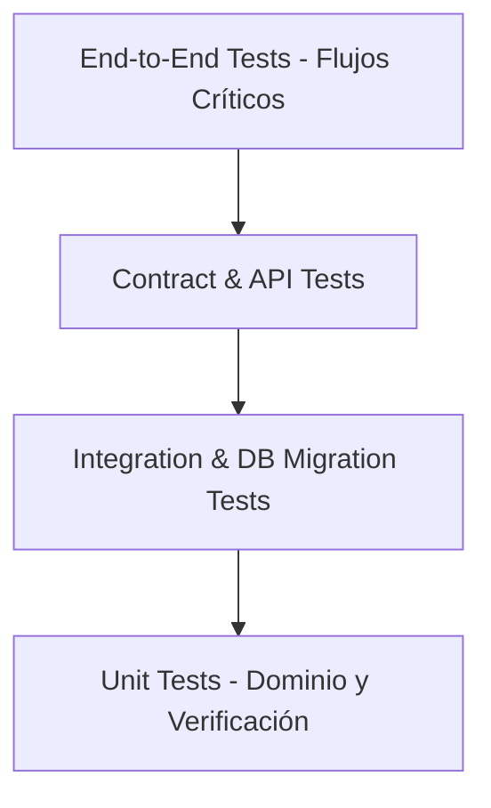
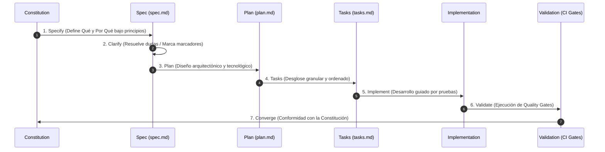

# GAMEA Social Monitor Constitution

<!--
  CONSTITUCIÓN DE DESARROLLO BASADO EN ESPECIFICACIONES (SDD)
  Proyecto: Control RRSS - Plataforma Institucional de Monitoreo y Analítica de Interacciones en Redes Sociales
  Entidad: Gobierno Autónomo Municipal de El Alto (GAMEA)
  Identificador Corto Interno: GAMEA Social Monitor
  Versión: 1.0.0
  Estado: RATIFICADA
  Fecha de Ratificación: 2026-09-17
  Última Enmienda: 2026-09-17
-->

> [!IMPORTANT]
> **ESTATUS NORMATIVO Y AUTORIDAD TÉCNICA MÁXIMA**
> La presente Constitución constituye la norma técnica, metodológica y arquitectónica suprema del proyecto **GAMEA Social Monitor**. Ninguna especificación funcional, plan de implementación (`/speckit.plan`), desglose de tareas (`/speckit.tasks`), diseño de base de datos, contrato de interfaz, código fuente, prueba automatizada o configuración de infraestructura podrá contradecir, debilitar ni omitir los principios y mandatos aquí establecidos.
> 
> En cualquier circunstancia de ambigüedad o conflicto normativo, rige el orden de prelación jerárquico:
> **Constitución > Especificación (`spec.md`) > Plan Arquitectónico (`plan.md`) > Contratos API > Tareas (`tasks.md`) > Código Fuente**.
>
> Toda excepción requerirá una Decisión Arquitectónica Formal (`Architecture Decision Record - ADR`) motivada, aprobada por el Comité Técnico e incorporada como enmienda versionada en este documento.

---

## Core Principles

### Principio I — Specification First (Especificación Antes que Implementación)
* **Mandato Normativo:**
  * Toda adición, modificación o retiro de funcionalidad **MUST** originarse y formalizarse en una especificación antes de escribir una sola línea de código ejecutable.
  * El ciclo de entrega **MUST** seguir sin excepciones el flujo gobernado:
    $$\text{Constitution} \longrightarrow \text{Specify} \longrightarrow \text{Clarify} \longrightarrow \text{Plan} \longrightarrow \text{Tasks} \longrightarrow \text{Implement} \longrightarrow \text{Validate} \longrightarrow \text{Converge}$$
  * La fase de especificación (`spec.md`) **MUST** describir con rigor el *QUÉ* (What) y el *POR QUÉ* (Why) del problema institucional antes de definir el *CÓMO* (How) técnico.
  * **MUST NOT** utilizarse decisiones tecnológicas prematuras para enmascarar la falta de claridad en las reglas de negocio o en los requerimientos funcionales.
* **Justificación:** Previene el desarrollo de funcionalidades innecesarias, costosas de mantener o desalineadas con la necesidad institucional del GAMEA, minimizando el retrabajo y asegurando claridad en el alcance.
* **Criterio de Cumplimiento:** Ninguna solicitud de cambio (`Pull Request`) será fusionada si no enlaza directamente a una especificación formal aprobada y a una tarea trazable en `tasks.md`.

### Principio II — Trazabilidad Completa (End-to-End Traceability)
* **Mandato Normativo:**
  * Todo requerimiento institucional **MUST** tener un identificador único e inmutable (ej. `REQ-MON-001`).
  * **MUST** existir una matriz de trazabilidad biunívoca e ininterrumpida que relacione:
    $$\text{Requerimiento} \to \text{Caso de Uso} \to \text{Regla de Negocio} \to \text{Modelo de Datos} \to \text{Endpoint/Contrato} \to \text{Tarea} \to \text{Código} \to \text{Prueba} \to \text{Resultado}$$
  * Cualquier elemento de software (función, tabla, endpoint, componente visual) que no pueda ser trazado a un requerimiento autorizado **MUST** ser considerado fuera de alcance (*scope creep*) y eliminado.
* **Justificación:** Garantiza la auditabilidad técnica del software ante entidades públicas de control y simplifica el análisis de impacto ante cambios normativos o de procesos.
* **Criterio de Cumplimiento:** Inspección estricta de trazabilidad en cada revisión arquitectónica mediante un grafo o matriz en `traceability.md`.

### Principio III — Privacidad y Protección de Datos por Diseño (Privacy by Design)
* **Mandato Normativo:**
  * La plataforma **MUST** incorporar principios de *Privacy by Design* y *Privacy by Default* en cada capa conceptual, lógica y física.
  * El sistema **MUST** recolectar únicamente los datos estrictamente indispensables para la verificación de interacciones institucionales autorizadas (*data minimization*).
  * El sistema **MUST NOT** monitorear, recolectar, analizar, indexar ni almacenar publicaciones privadas, perfiles personales, fotografías, círculos de amistad, ubicación en tiempo real ni actividad ajena a los canales institucionales explícitamente definidos del GAMEA.
  * Todo dato personal identificable (PII) de los funcionarios **MUST** estar protegido con cifrado en reposo y en tránsito.
  * El sistema **MUST** definir períodos de retención documental y mecanismos automáticos de purga o anonimización una vez cumplida la vigencia institucional.
  * Toda consulta o acceso a registros que vinculen a un funcionario con sus cuentas sociales **MUST** registrarse en bitácoras de auditoría inmutables.
  * Todo tratamiento de datos que genere incertidumbre jurídica respecto a la legislación boliviana **MUST** ser marcado como `LEGAL_REVIEW_REQUIRED`.
* **Justificación:** Previene la vulneración de derechos fundamentales a la privacidad y dignidad de los servidores públicos, evitando que la plataforma se convierta en una herramienta de vigilancia extralaboral.
* **Criterio de Cumplimiento:** Aprobación explícita de impacto de privacidad en cada modelo de datos y cero atributos persistidos que no tengan una justificación institucional explícita.

### Principio IV — APIs Oficiales Antes que Scraping
* **Mandato Normativo:**
  * Todas las integraciones con Meta (Facebook Graph API / Webhooks) y TikTok (TikTok for Developers / Content & Display APIs) **MUST** utilizar canales, endpoints, bibliotecas SDK y mecanismos de autenticación oficialmente provistos y documentados por las plataformas.
  * **MUST NOT** implementarse scraping HTML, técnicas de *headless browser automation* no autorizadas, evasión de CAPTCHAs, emulación de sesiones humanas de usuario, rotación de direcciones IP, credenciales compartidas o cualquier método contrario a los Términos de Servicio de Meta y TikTok.
  * Cuando una plataforma externa limite o elimine el acceso a determinado dato (ej. lista completa de usuarios que dieron Like o compartieron un post público), el sistema **MUST** registrar de forma explícita estados estandarizados como `NOT_OBSERVABLE`, `API_RESTRICTED` o `UNAVAILABLE`.
  * El sistema **MUST NOT** inferir o imputar que un funcionario "no interactuó" basándose en la simple ausencia del dato provocada por una restricción de la API externa.
* **Justificación:** Garantiza la viabilidad operativa y legal del sistema, previniendo el bloqueo de cuentas institucionales del GAMEA, sanciones legales y fragilidad técnica ante cambios de maquetación HTML.
* **Criterio de Cumplimiento:** Auditoría de dependencias y código de integración; cualquier paquete de emulación o scraping (ej. Puppeteer sin justificación visual interna, Selenium, scripts de extracción no autorizada) está terminantemente vetado para la recolección de interacciones.

### Principio V — No Inventar Datos (Fidelidad y Tipificación Epistémica)
* **Mandato Normativo:**
  * El sistema **MUST** clasificar taxativamente la naturaleza y procedencia de cada registro de interacción en una de las siguientes categorías epistemológicas:
    1. `DATO_OBSERVADO`: Recibido directamente por webhook o endpoint oficial verificado.
    2. `DATO_CONFIRMADO`: Cruzado y verificado positivamente con la identidad institucional y cuenta vinculada del funcionario.
    3. `DATO_INFERIDO`: Estimado a partir de reglas analíticas documentadas (requiere justificación algorítmica visible).
    4. `DATO_DECLARADO`: Suministrado por el funcionario u operador mediante declaración manual.
    5. `DATO_IMPORTADO`: Proveniente de procesos de migración histórica previa.
    6. `DATO_NO_DISPONIBLE`: No proporcionado por la plataforma en el momento de consulta.
    7. `DATO_NO_VERIFICABLE`: Datos con identificadores externos opacos o anonimizados por la red social.
    8. `ERROR_TECNICO`: Incidencia en el conector, timeout o falla de red.
  * **MUST NOT** generarse registros sintéticos, aproximaciones arbitrarias o valores booleanos falsos para suplir información incompleta en bases de datos o reportes.
  * Los reportes ejecutivos, operacionales y tableros visuales **MUST** mantener y reflejar inequívocamente esta tipificación.
* **Justificación:** Asegura la veracidad de la información pública institucional y protege el rigor técnico de la administración municipal frente a decisiones sustentadas en datos inexactos o manipulados.
* **Criterio de Cumplimiento:** Todo esquema de datos que almacene interacciones debe incluir el campo tipificado y las vistas no deben agrupar bajo una misma métrica datos confirmados y datos inferidos o restringidos.

### Principio VI — Proveniencia del Dato (Data Provenance & Audit Trail)
* **Mandato Normativo:**
  * Todo registro de interacción obtenido de una fuente externa **MUST** almacenar metadata forense completa:
    * `source_platform`: Identificador de la plataforma (ej. `FACEBOOK`, `TIKTOK`).
    * `source_account_id`: Identificador institucional de la página o perfil emisor.
    * `source_object_id`: Identificador de la publicación institucional monitoreada.
    * `external_interaction_id`: ID del comentario o interacción provisto por la red social.
    * `external_author_id`: ID técnico del autor según el alcance de la API (ej. ASID / App-Scoped User ID).
    * `capture_method`: Vía de captura (`WEBHOOK`, `POLLING_SYNC`, `MANUAL_VERIFICATION`).
    * `captured_at`: Marca temporal UTC de captura en el sistema.
    * `external_created_at`: Marca temporal original emitida por la red social.
    * `last_verified_at`: Fecha y hora UTC de la última comprobación exitosa.
    * `api_version`: Versión exacta de la API externa utilizada (ej. `v20.0`).
    * `verification_status`: Estado canónico del ciclo de verificación.
    * `raw_payload_ref`: Puntero o hash criptográfico del payload inmutable de origen.
* **Justificación:** Permite reproducir, auditar y contrastar cualquier afirmación analítica ante impugnaciones técnicas, auditorías internas del GAMEA o requerimientos legales.
* **Criterio de Cumplimiento:** Imposibilidad estructural en base de datos de crear registros de interacción sin los metadatos obligatorios de proveniencia.

### Principio VII — Identidad Única del Funcionario (Identity Decoupling)
* **Mandato Normativo:**
  * El funcionario **MUST** identificarse mediante un código institucional único, unívoco e inmutable (ej. `ID_FUNCIONARIO` o Código de Empleado institucional del GAMEA).
  * El sistema **MUST NOT** utilizar nombres visibles, alias, usernames temporales o enlaces de perfil de redes sociales como clave primaria o identificador de identidad.
  * La vinculación entre el funcionario y sus cuentas en redes sociales **MUST** modelarse como una relación de 1 a N desacoplada:
    $$\text{Funcionario} \longrightarrow \text{Identidad Institucional} \longrightarrow \text{Cargo/Unidad} \longrightarrow \text{Vínculo Social} \longrightarrow \text{Cuenta Externa (Plataforma + External ID)}$$
  * Los cambios de nombre de usuario (*handle*), foto de perfil o personalización en la red social **MUST NOT** alterar ni degradar la integridad del registro histórico del funcionario.
* **Justificación:** Los nombres en redes sociales sufren frecuentes modificaciones y homonimias. Separar la identidad municipal de la identidad digital externa evita corrupción y pérdida de historial.
* **Criterio de Cumplimiento:** Pruebas automatizadas que validen que la mutación de un username externo no altera el historial analítico del funcionario.

### Principio VIII — Fuente Maestra de Funcionarios (HR Source of Truth)
* **Mandato Normativo:**
  * El sistema **MUST** reconocer al subsistema o base de datos de Recursos Humanos del GAMEA como la única Fuente Maestra de la Verdad (`Single Source of Truth - SSoT`) de la nómina de funcionarios.
  * La plataforma **GAMEA Social Monitor** **MUST NOT** asumir funciones de administración central de personal, cálculo salarial o control de asistencia.
  * Los procesos de alta, baja, transferencia, rotación de unidad o cambio de cargo **MUST** ser consumidos de manera sincronizada y auditable desde la fuente de RR.HH. (o archivo maestro de personal autorizado mientras se consolide la integración directa).
  * Cuando un funcionario sea dado de baja en RR.HH., su estado en la plataforma **MUST** pasar a `INACTIVO` o `DESVINCULADO`, preservando intacto su histórico inmutable de interacciones pasadas.
* **Justificación:** Evita la divergencia de padrones de personal entre dependencias municipales y previene inconsistencias administrativas.
* **Criterio de Cumplimiento:** Existencia de adaptadores de ingesta de nómina con validación de hash de sincronización y bitácora de novedades de personal.

### Principio IX — Modelo de Datos Normalizado
* **Mandato Normativo:**
  * La base de datos operacional **MUST** diseñarse en estricta conformidad con las formas normales de bases de datos relacionales o estructuradas para garantizar integridad referencial y prevenir anomalías de actualización.
  * La estructura del archivo Excel utilizado históricamente **MUST** considerarse exclusivamente como una vista de exportación o reporte y **MUST NOT** dictar el esquema operacional de la base de datos.
  * El modelo conceptual y lógico de dominio **MUST** incluir como mínimo las siguientes entidades independientes:
    * `Employee` (Funcionario)
    * `OrganizationalUnit` (Unidad Organizacional / Secretaría / Dirección)
    * `Position` (Cargo)
    * `SocialPlatform` (Catálogo de plataformas soportadas)
    * `InstitutionalAccount` (Cuentas oficiales verificadas del GAMEA)
    * `SocialAccount` (Cuentas sociales vinculadas a funcionarios)
    * `Publication` (Publicaciones institucionales objeto de monitoreo)
    * `MonitoringCampaign` (Campañas de comunicación o periodos definidos)
    * `MonitoringTarget` (Objetivos de cobertura o alcance por unidad)
    * `Interaction` (Registro canónico de interacciones)
    * `InteractionEvidence` (Evidencias técnicas y metadatos)
    * `Verification` (Juicio y estado de verificación técnica)
    * `ExternalSyncJob` (Trabajos de sincronización externa)
    * `ReportExecution` (Histórico de reportes emitidos)
    * `User` (Usuarios con acceso al sistema)
    * `Role` (Roles del sistema)
    * `Permission` (Permisos granulares)
    * `AuditEvent` (Eventos de auditoría del sistema)
  * **MUST NOT** duplicarse los datos biográficos de los funcionarios por cada registro de publicación o interacción.
* **Justificación:** Garantiza la consistencia lógica, facilita la indexación eficiente, permite consultas analíticas escalables y previene la degradación del rendimiento.
* **Criterio de Cumplimiento:** Diagrama entidad-relación normalizado aprobado y esquemas DDL con restricciones de clave foránea e índices requeridos.

### Principio X — Historial Inmutable y Auditoría Integral
* **Mandato Normativo:**
  * Toda operación que cree, modifique, desvincule o anule registros sensibles en el sistema **MUST** generar un registro de auditoría estructurado e inmutable.
  * Cada evento de auditoría **MUST** registrar de forma obligatoria:
    * `audit_id`: Identificador unívoco del evento.
    * `user_id` / `service_id`: Sujeto que ejecutó la acción.
    * `action`: Operación ejecutada (`CREATE`, `UPDATE`, `DELETE`, `SYNC`, `EXPORT`, `LOGIN`).
    * `entity_name` & `entity_id`: Recurso afectado.
    * `pre_image`: Estado de los datos antes de la operación (en mutaciones).
    * `post_image`: Estado de los datos posterior a la operación.
    * `timestamp_utc`: Marca temporal inalterable en UTC.
    * `client_ip`: Dirección IP de origen de la solicitud.
    * `correlation_id`: Identificador global de rastreo distribuido.
    * `execution_status`: Resultado de la operación (`SUCCESS`, `DENIED`, `FAILURE`).
  * Los registros de auditoría **MUST NOT** permitir operaciones de actualización (`UPDATE`) o eliminación física (`DELETE`) en la capa de aplicación ni en la base de datos operacional.
* **Justificación:** Cumplimiento de estándares de rendición de cuentas del sector público, facilitando peritajes técnicos y revisiones de transparencia institucional.
* **Criterio de Cumplimiento:** Verificación de almacenamiento tipo *append-only* en las tablas de auditoría y tests que demuestren bloqueo ante intentos de modificación de eventos ya grabados.

### Principio XI — Arquitectura Modular
* **Mandato Normativo:**
  * El sistema **MUST** diseñarse bajo una estricta modularidad lógica basada en contextos delimitados (*Bounded Contexts*), garantizando alta cohesión y bajo acoplamiento.
  * Se definen como mínimo los siguientes módulos de dominio:
    1. `Identity & Access Management (IAM)`
    2. `Employee Directory & Organization`
    3. `Social Account Binding`
    4. `Institutional Publishing Catalog`
    5. `Facebook Integration Adapter`
    6. `TikTok Integration Adapter`
    7. `Monitoring & Orchestration Engine`
    8. `Interaction Processing & Evidence`
    9. `Verification & Business Rules`
    10. `Reporting & Analytics Engine`
    11. `Operational & Executive Dashboard`
    12. `System Notifications`
    13. `Security & Audit Trail`
    14. `System Administration & Configuration`
  * Ningún módulo **MUST** acceder de forma directa o acoplada a estructuras internas o esquemas privados de persistencia de otro módulo; la comunicación entre ellos **MUST** realizarse exclusivamente mediante interfaces de servicio públicas o contratos de eventos.
* **Justificación:** Mantiene el código entendible, facilita el desarrollo concurrente entre equipos y permite evolucionar partes críticas sin riesgo de regresión sistémica.
* **Criterio de Cumplimiento:** Análisis estático de dependencias que demuestre ausencia de ciclos de dependencia o accesos ilegítimos entre módulos.

### Principio XII — Integraciones Desacopladas (Hexagonal / Ports & Adapters)
* **Mandato Normativo:**
  * El núcleo del dominio del negocio **MUST NOT** importar librerías, DTOs específicos ni conocer particularidades de las APIs de Graph (Meta), TikTok o cualquier otra red social.
  * Todas las interacciones con plataformas externas **MUST** estructurarse conceptualmente mediante puertos de dominio e implementarse en adaptadores especializados:
    $$\text{Domain Core} \longrightarrow \text{Integration Port (Interface)} \longleftarrow \text{Social Platform Adapter}$$
  * Una modificación en la estructura JSON, autenticación o endpoint de Facebook o TikTok **SHOULD NOT** forzar cambios en la lógica de negocio ni en el modelo central de entidades.
* **Justificación:** Aísla el valor del negocio de la volatilidad extrema de los proveedores de redes sociales comerciales, permitiendo actualizar conectores sin poner en peligro el core institucional.
* **Criterio de Cumplimiento:** Inspección de imports y namespaces en la capa de dominio comprobando cero dependencias hacia SDKs de terceros.

### Principio XIII — Versionado de Integraciones y Gestión de Secretos
* **Mandato Normativo:**
  * Toda llamada a una API externa **MUST** declarar explícitamente la versión de API utilizada en cada transacción.
  * **MUST** existir un procedimiento de pruebas de regresión y análisis de compatibilidad antes de migrar la versión de API en un adaptador.
  * Credenciales de acceso, App Secrets, Client Keys, Tokens de larga duración y contraseñas de infraestructura **MUST NOT** estar jamás presentes en repositorios de código ni en imágenes de contenedor base.
  * Los secretos **MUST** inyectarse exclusivamente en tiempo de ejecución mediante variables de entorno protegidas o sistemas administrados de gestión de secretos (*Secret Store*).
* **Justificación:** Previene brechas de seguridad catastróficas por exposición de credenciales y asegura control ante la deprecación programada de versiones de APIs externas.
* **Criterio de Cumplimiento:** Reglas de pre-commit y pipelines CI con escaneo activo de secretos (ej. GitLeaks o Trufflehog) configurados como bloqueantes.

### Principio XIV — Resiliencia ante Fallos Externos
* **Mandato Normativo:**
  * La indisponibilidad, latencia severa o caída de las plataformas de Facebook o TikTok **MUST NOT** comprometer la disponibilidad del sistema interno ni provocar pérdida de datos ya capturados.
  * Todas las operaciones de sincronización e ingesta masiva **MUST** ejecutarse de forma asincrónica mediante colas de trabajo o procesos en segundo plano.
  * Los adaptadores de integración **MUST** incorporar:
    * Reintentos automáticos con retroceso exponencial (*Exponential Backoff*) y dispersión aleatoria (*Jitter*).
    * Mecanismos de colas de mensajes fallidos (*Dead Letter Queue - DLQ*) tras agotar los reintentos permitidos.
    * Patrón de cortocircuito (*Circuit Breaker*) para suspender peticiones masivas ante fallos consecutivos del proveedor.
    * Monitoreo y captura de códigos HTTP `429 Too Many Requests` para respetar las cuotas de tasa de uso (*Rate Limits*).
* **Justificación:** Las redes sociales son servicios externos fuera del control del GAMEA; el sistema debe operar con robustez y predecibilidad ante contingencias de red o límites de cuota.
* **Criterio de Cumplimiento:** Pruebas de inyección de fallos e integración con servidores simulados que validen el comportamiento del circuito y la preservación de mensajes en DLQ.

### Principio XV — Idempotencia en Ingesta y Procesamiento
* **Mandato Normativo:**
  * Toda operación de ingesta externa, recepción de webhook, sincronización programada o importación masiva **MUST** diseñarse para ser estrictamente idempotente.
  * La recepción reiterada del mismo payload o evento de interacción **MUST NOT** generar registros duplicados ni alterar los contadores analíticos consolidados.
  * Las claves de idempotencia **MUST** computarse combinando la plataforma de origen, el identificador externo de la publicación y el identificador único de la interacción externa.
* **Justificación:** Debido a la naturaleza no garantizada de las redes ("al menos una vez" en entrega de webhooks o reintentos automáticos), la falta de idempotencia corrompe los datos estadísticos.
* **Criterio de Cumplimiento:** Tests de integración que envíen el mismo payload 10 veces de forma concurrente verificando la creación de exactamente un único registro.

### Principio XVI — Seguridad por Diseño y Mínimo Privilegio
* **Mandato Normativo:**
  * El sistema **MUST** estructurarse bajo el principio de *Security by Design* y *Principle of Least Privilege (PoLP)*.
  * Toda comunicación externa e interna **MUST** requerir cifrado TLS 1.3 (o mínimo TLS 1.2 estricto con suites de cifrado seguras).
  * Todos los endpoints de entrada **MUST** implementar validación estricta de esquemas, saneamiento contra inyecciones (SQLi, NoSQLi, XSS) y protección contra el catálogo completo de vulnerabilidades OWASP Top 10.
  * Los mecanismos de autenticación **MUST** utilizar tokens criptográficos con expiración corta, renovación controlada y almacenamiento seguro en clientes.
  * Endpoints de consulta y reporte **MUST** implementar mecanismos de limitación de tasa (*Rate Limiting*) para mitigar ataques de denegación de servicio o extracción abusiva de datos.
* **Justificación:** Salvaguarda los activos digitales del Gobierno Autónomo Municipal de El Alto contra ataques cibernéticos, fugas de datos y sabotajes operacionales.
* **Criterio de Cumplimiento:** Escaneo dinámico (DAST) y estático (SAST) sin vulnerabilidades de severidad crítica o alta activas en los reportes de seguridad.

### Principio XVII — Control de Acceso Basado en Roles (RBAC Estricto en Backend)
* **Mandato Normativo:**
  * Toda autorización de lectura, escritura, sincronización o reporte **MUST** verificarse de manera exhaustiva en la capa de backend para cada solicitud individual.
  * Ocultar o deshabilitar elementos de la interfaz de usuario en el frontend **MUST NOT** considerarse una medida de seguridad válida.
  * Se definen de forma conceptual y prescriptiva los siguientes roles institucionales:
    * `Super Administrator`: Control total de infraestructura, auditoría y roles.
    * `System Administrator`: Configuración técnica de conectores y parámetros del sistema.
    * `Communications Administrator`: Gestión de campañas, cuentas institucionales y enlaces de seguimiento.
    * `Analyst`: Generación y análisis de reportes, consultas operativas de interacción.
    * `Auditor`: Acceso de sólo lectura a registros de auditoría y trazas de verificación.
    * `Read Only`: Visualización de tableros ejecutivos consolidados sin acceso a PII de funcionarios.
    * `Integration Service`: Credencial técnica para comunicación máquina a máquina con RR.HH.
* **Justificación:** Evita la elevación no autorizada de privilegios y garantiza que cada funcionario u operador acceda únicamente a los datos acordes a sus atribuciones legales.
* **Criterio de Cumplimiento:** Suite de pruebas de seguridad automatizadas que intenten consumir endpoints administrativos con tokens de menor privilegio, debiendo responder unívocamente `403 Forbidden`.

### Principio XVIII — Calidad del Software y Mantenibilidad
* **Mandato Normativo:**
  * El código fuente **MUST** mantener una estructura limpia, auto-documentada, con nomenclatura uniforme en un único idioma canónico acordado (preferentemente nombres de dominio claros) y bajo acoplamiento.
  * Las funciones y módulos **MUST** regirse por el principio de responsabilidad única (*Single Responsibility Principle - SRP*).
  * **MUST NOT** introducirse patrones de diseño complejos o sobreingeniería sin una necesidad técnica demostrada y vinculada a un requerimiento explícito.
  * El manejo de errores **MUST** ser explícito; los bloques de captura genéricos que silencien excepciones sin registro estructurado están estrictamente prohibidos.
* **Justificación:** Maximiza la vida útil del sistema y facilita que nuevos ingenieros del GAMEA puedan comprender, depurar y extender la plataforma eficientemente.
* **Criterio de Cumplimiento:** Cumplimiento de métricas de complejidad ciclomática máxima definida en linters y aprobación de revisiones de código cruzadas por pares.

### Principio XIX — Estrategia de Testing Automatizado Basada en Riesgo
* **Mandato Normativo:**
  * El desarrollo **MUST** aplicar una pirámide de pruebas automatizadas rigurosa:
    * *Unit Tests*: Para todas las reglas de negocio, validaciones, mapeos y cálculos de verificación (cobertura de ramas crítica).
    * *Integration Tests*: Para adaptadores de base de datos, colas y componentes de procesamiento.
    * *Contract Tests*: Para todos los contratos API internos y simuladores de integraciones externas.
    * *Database Migration Tests*: Verificación de migraciones arriba/abajo (`up`/`down`) en entornos efímeros limpios.
    * *Security Tests*: Pruebas automatizadas de inyección, autenticación y autorización RBAC.
    * *End-to-End Tests*: Para los flujos críticos (ej. ciclo completo desde publicación hasta reporte consolidado).
  * Para Facebook y TikTok **MUST** desarrollarse simuladores (*fakes/mocks*) controlados basados en contratos de respuesta reales, evitando que el pipeline CI dependa de conexiones a redes externas.
  * Ninguna funcionalidad se considerará terminada si no cuenta con sus pruebas asociadas aprobadas en el pipeline de integración continua.
* **Justificación:** Previene regresiones, garantiza estabilidad continua y elimina la incertidumbre ante despliegues frecuentes.
* **Criterio de Cumplimiento:** Cobertura de pruebas mínima de 80% sobre la lógica de dominio y 100% de los flujos de cálculo de verificación cubiertos por pruebas unitarias.

### Principio XX — Contract-First para Integraciones y APIs
* **Mandato Normativo:**
  * Toda interfaz de comunicación entre el frontend y el backend, o entre servicios internos, **MUST** definirse previamente mediante un contrato explícito y estandarizado (ej. especificación OpenAPI 3.0+ / AsyncAPI).
  * El contrato **MUST** describir detalladamente: esquemas de solicitud (`request`), esquemas de respuesta (`response`), posibles códigos y esquemas de error, requerimientos de autenticación, encabezados de idempotencia y versiones soportadas.
  * Las implementaciones de cliente y servidor **SHOULD** generarse o validarse directamente contra el contrato para garantizar concordancia formal.
* **Justificación:** Permite el desarrollo paralelo e independiente entre equipos de frontend, backend y QA, eliminando malentendidos en la integración.
* **Criterio de Cumplimiento:** Validación automática de conformidad de esquemas en tiempo de prueba y documentación interactiva autogenerada a partir de los contratos aprobados.

### Principio XXI — Migraciones de Base de Datos Versionadas y Controladas
* **Mandato Normativo:**
  * Cualquier alteración de la estructura, índices o restricciones de la base de datos **MUST** ejecutarse mediante scripts de migración versionados, lineales y auditables en el repositorio de código.
  * **MUST NOT** realizarse modificaciones manuales directas en esquemas de bases de datos en entornos de Testing, Staging o Producción.
  * Cada migración **MUST** ser idempotente o atómica (cuando el motor de BD lo soporte transaccionalmente) y contar con una estrategia verificable de reversión (*rollback*).
  * Las migraciones en producción **MUST** diseñarse para garantizar retrocompatibilidad (*zero-downtime migrations* mediante patrones expandir/contraer).
* **Justificación:** Protege la integridad y consistencia de los datos del municipio, evitando estados corruptos o inconsistencias estructurales entre ambientes.
* **Criterio de Cumplimiento:** Ejecución limpia de todo el historial de migraciones en una base de datos vacía durante las pruebas automáticas del pipeline CI.

### Principio XXII — Observabilidad Integral y Monitoreo Activo
* **Mandato Normativo:**
  * Toda aplicación y proceso en segundo plano **MUST** emitir registros en formato estructurado (ej. JSON) que incluyan como estándar: timestamp UTC, nivel de severidad, mensaje claro, identificador de módulo y correlation ID.
  * Los logs **MUST NOT** contener bajo ninguna circunstancia datos sensibles como contraseñas, secretos de API, tokens de sesión o información PII sin enmascarar.
  * El sistema **MUST** proveer endpoints de verificación de salud (*Health Checks*) diferenciando salud básica (*Liveness*) y capacidad de procesar tráfico (*Readiness*).
  * **MUST** exponerse métricas operacionales clave: latencia de adaptadores de Facebook/TikTok, errores HTTP por plataforma, tasa de consumo de colas, trabajos fallidos en DLQ y uso de recursos de servidor.
* **Justificación:** Facilita la detección temprana y resolución expedita de incidentes operativos antes de que impacten a los usuarios institucionales.
* **Criterio de Cumplimiento:** Verificación de trazabilidad distribuida funcional en todas las transacciones que crucen múltiples componentes y ausencia de secretos en los logs tras auditoría estática.

### Principio XXIII — Estados Canónicos de Sincronización e Ingesta
* **Mandato Normativo:**
  * Todo trabajo de sincronización, consulta o procesamiento de interacción **MUST** operar bajo una máquina de estados determinista y explícita, que incluirá obligatoriamente:
    * `PENDING`: Encolado a la espera de ejecución.
    * `PROCESSING`: En curso de llamada o procesamiento activo.
    * `SUCCESS`: Completado satisfactoriamente con obtención integral de datos.
    * `PARTIAL`: Completado pero con omisión de campos no provistos por la plataforma externa.
    * `FAILED`: Fallo irrecuperable de infraestructura o datos no subsanable automáticamente.
    * `RETRYING`: Fallo temporal en espera de reintento controlado con backoff.
    * `RATE_LIMITED`: Suspendido temporalmente por consumo de cuota de API de la plataforma.
    * `AUTH_ERROR`: Credencial, token o permiso de página vencido o revocado en la red social.
    * `API_RESTRICTED`: Capacidad deliberadamente no ofrecida por la red social según sus políticas.
    * `NOT_OBSERVABLE`: Imposibilidad técnica de determinar el evento con las herramientas oficiales.
  * **MUST NOT** transformarse silenciosamente un error técnico de conexión en un resultado funcional de negocio.
* **Justificación:** Evita diagnósticos erróneos y proporciona absoluta transparencia operacional al equipo de comunicaciones y analistas del GAMEA.
* **Criterio de Cumplimiento:** Diagrama y código de máquina de estados validado por tests que verifiquen las transiciones permitidas y el rechazo de saltos de estado inválidos.

### Principio XXIV — Reportes Reproducibles y No Volátiles
* **Mandato Normativo:**
  * Cualquier reporte generado (incluyendo hojas de cálculo Excel) **MUST** ser completamente reproducible a partir de los datos históricos consolidados en la base de datos.
  * Para cada emisión de reporte, el sistema **MUST** almacenar de forma persistente:
    * Identificador del reporte y versión del motor generador.
    * Usuario solicitante y fecha/hora UTC exacta de generación.
    * Parámetros de entrada, filtros temporales, unidades organizacionales y campañas aplicadas.
    * Instantánea (*snapshot*) o puntero inmutable al conjunto de datos utilizado para el cómputo.
    * Hash criptográfico del archivo generado para comprobación de integridad.
  * Un archivo Excel exportado **MUST NOT** constituir la única copia de respaldo oficial ni considerarse la base de datos de origen de la información.
* **Justificación:** Permite dirimir discrepancias sobre cifras emitidas en fechas pasadas y garantiza respaldo técnico ante requerimientos de informes de gestión.
* **Criterio de Cumplimiento:** Capacidad demostrada del sistema de regenerar exactamente el mismo contenido numérico de un reporte emitido previamente al ingresar los mismos parámetros históricos.

### Principio XXV — Dashboard Basado en Datos Verificables y Lógica Centralizada
* **Mandato Normativo:**
  * Los tableros de control (*Dashboards*) operativos y ejecutivos **MUST** consumir exclusivamente las fuentes y servicios provistos por la capa de backend oficial.
  * **MUST NOT** implementarse cálculos de indicadores analíticos complejos, agregaciones de negocio o reglas de verificación en el frontend o cliente web.
  * Las vistas de dashboard y los reportes exportables en Excel **MUST** calcularse utilizando las mismas funciones y reglas canónicas del dominio para garantizar consistencia total entre pantallas e informes impresos.
* **Justificación:** Previene que un directivo visualice en el tablero cifras distintas a las impresas en los reportes descargados por los analistas.
* **Criterio de Cumplimiento:** Verificación de que las respuestas del API entregan métricas pre-calculadas o consistentes y no datos crudos dependientes de la interpretación del navegador.

### Principio XXVI — Semántica Rigurosa y Transparencia de Indicadores
* **Mandato Normativo:**
  * Todo indicador porcentual, tasa o métrica presentada en la plataforma **MUST** declarar explícitamente en su ficha técnica y visualización:
    * Numerador exacto y fórmula de cálculo.
    * Denominador exacto y criterios de población considerada.
    * Período temporal analizado.
    * Población total y población excluida por criterios válidos (ej. bajas, licencias).
    * Tratamiento aplicado a los datos no observables o restringidos por la API.
  * El sistema **MUST** diferenciar tajantemente conceptos estadísticos como:
    * *Porcentaje de cobertura sobre interacciones técnicamente observables.*
    * *Porcentaje sobre el total de la nómina municipal.*
* **Justificación:** Evita la distorsión de la realidad institucional y protege a los funcionarios de interpretaciones equívocas basadas en métricas con denominadores opacos.
* **Criterio de Cumplimiento:** Tooltips y documentación de indicadores integrados en la UI que expliciten la fórmula matemática de cada métrica visible.

### Principio XXVII — Prohibición de Rankings y Puntuaciones Reputacionales Automáticas
* **Mandato Normativo:**
  * La plataforma **MUST NOT** generar automáticamente calificaciones personales, sistemas de puntuación individual (*scoring*), listas de clasificación competitiva (*rankings* de funcionarios más/menos activos), etiquetas peyorativas ni conclusiones automatizadas sobre desempeño laboral sustentadas únicamente en likes, compartidos o comentarios.
  * El sistema está concebido exclusivamente para el seguimiento administrativo, verificación técnica y analítica de cobertura comunicacional institucional.
  * Cualquier funcionalidad futura de evaluación **MUST** tramitarse como una iniciativa independiente, sometida a revisión legal institucional, con aprobación del área de Recursos Humanos del GAMEA y tipificada como enmienda constitucional.
* **Justificación:** Previene la discriminación, el acoso laboral o el uso punitivo indebido de herramientas tecnológicas en el ámbito del servicio público.
* **Criterio de Cumplimiento:** Inspección algorítmica en revisiones de código; ausencia total de funciones de ordenamiento descendente personal tipo "top funcionarios", índices sintéticos de lealtad o puntuaciones automatizadas.

### Principio XXVIII — Explicabilidad y Justificación de Estados al Usuario
* **Mandato Normativo:**
  * Todo estado o resultado mostrado al usuario sobre una interacción o verificación **MUST** ser plenamente explicable a través de la interfaz mediante detalles contextuales comprensibles.
  * Ante una verificación afirmativa (ej. "Comentario Confirmado"), el sistema **MUST** brindar acceso a la justificación técnica: publicación asociada, fecha/hora oficial, enlace público (si aplica), cuenta vinculada y método de confirmación.
  * Ante un estado no confirmatorio (ej. "Interacción No Verificable" o "Dato No Disponible"), el sistema **MUST** explicar con claridad la causa subyacente (ej. "Restricción de la API oficial de la red social: La plataforma no provee la identidad de los usuarios que interactuaron").
* **Justificación:** Fomenta la confianza y transparencia en el uso del sistema tanto para los operadores como para los funcionarios sujetos a seguimiento.
* **Criterio de Cumplimiento:** En todas las pantallas de detalle de interacción debe existir un componente de explicación contextual accesible con un clic.

### Principio XXIX — Tratamiento Estandarizado de Fechas y Zonas Horarias
* **Mandato Normativo:**
  * Todas las marcas temporales en bases de datos operacionales, colas de mensajería, eventos de auditoría y registros de log **MUST** almacenarse obligatoriamente en formato UTC en campos nativos de fecha y hora (*timestamp with time zone*).
  * **MUST NOT** almacenarse fechas en campos de texto simple (`VARCHAR`/`TEXT`) ni en formatos numéricos ambiguos.
  * La conversión a la zona horaria institucional oficial de Bolivia (`America/La_Paz`, UTC-4) **MUST** aplicarse de forma explícita en la capa de presentación o formateo de reportes de salida, configurada mediante parámetro de sistema.
* **Justificación:** Evita inconsistencias temporales, errores en el cálculo de plazos administrativos y problemas de desfasaje en publicaciones nocturnas.
* **Criterio de Cumplimiento:** Tests unitarios de persistencia que confirmen almacenamiento en UTC y renderizado fiel en hora local boliviana.

### Principio XXX — Escalabilidad y Procesamiento Asincrónico
* **Mandato Normativo:**
  * El diseño arquitectónico **MUST** prever el crecimiento de escala de la institución soportando el incremento sostenido en: volumen de funcionarios (miles), publicaciones activas, volumen diario de comentarios e histórico plurianual de datos.
  * Operaciones de alta latencia o procesamiento intensivo (ingesta de APIs externas, procesamiento de webhooks, generación de reportes voluminosos, sincronización de nómina) **MUST** procesarse de forma asincrónica fuera del ciclo de petición-respuesta HTTP principal.
  * El almacenamiento y las consultas analíticas **SHOULD** estructurarse con índices optimizados, particionamiento lógico o temporal cuando el volumen lo demande.
* **Justificación:** Garantiza que el sistema responda con agilidad a los usuarios concurrentes sin degradarse durante los picos de interacción en redes sociales.
* **Criterio de Cumplimiento:** Pruebas de carga que demuestren tiempos de respuesta en API inferiores a 500ms para el 95% de las consultas ordinarias bajo concurrencia esperada.

### Principio XXXI — Configuración Externalizada sobre Código
* **Mandato Normativo:**
  * Todos los parámetros operativos sujetos a variación institucional (umbrales de tiempo, frecuencias de sincronización de cronjobs, límites de paginación, catálogo de secretarías, cuotas de peticiones) **MUST** ser administrables mediante variables de configuración o registros de base de datos de administración.
  * **MUST NOT** quemarse (*hardcode*) constantes de negocio, identificadores de páginas sociales, credenciales o URLs de servicios en el código fuente.
  * Toda modificación de configuración administrativa **MUST** registrarse en la bitácora de auditoría.
* **Justificación:** Permite al equipo de comunicaciones y sistemas adaptar el comportamiento del software sin requerir nuevas compilaciones ni despliegues de código.
* **Criterio de Cumplimiento:** Búsqueda en código de valores constantes sensibles o de configuración que deban residir en el esquema de configuración del sistema.

### Principio XXXII — Portabilidad e Independencia de Infraestructura
* **Mandato Normativo:**
  * La lógica de negocio y los servicios del sistema **MUST** diseñarse para ser neutrales respecto al proveedor de nube o infraestructura física (*Cloud Agnostic*).
  * Las aplicaciones **MUST** empaquetarse siguiendo estándares abiertos (ej. contenedores OCI / Docker) garantizando su ejecución indistinta en servidores locales (*on-premise*) del GAMEA o en plataformas en la nube.
  * El código de la aplicación **MUST NOT** utilizar APIs propietarias de un único proveedor de nube que impidan la migración del sistema.
* **Justificación:** Preserva la soberanía tecnológica y autonomía de gestión de infraestructura informática del Gobierno Autónomo Municipal de El Alto.
* **Criterio de Cumplimiento:** Capacidad de levantar el entorno completo de desarrollo y pruebas mediante herramientas de orquestación estándar en cualquier host compatible.

### Principio XXXIII — Respaldo, Integridad y Recuperación ante Desastres
* **Mandato Normativo:**
  * La arquitectura **MUST** contar con un procedimiento automatizado y periódico de copias de seguridad (*backups*) completas e incrementales de las bases de datos y configuraciones.
  * Un respaldo **MUST NOT** considerarse válido si no ha sido sometido a pruebas periódicas de restauración exitosa y comprobación de integridad de datos.
  * Se definen como metas preliminares del sistema (sujetas a ratificación en `/speckit.plan`):
    * Objetivo de Punto de Recuperación (`RPO`): Máximo 24 horas de pérdida de datos en caso de catástrofe mayor.
    * Objetivo de Tiempo de Recuperación (`RTO`): Restauración operativa completa del servicio en menos de 4 horas.
  * Los archivos de respaldo **MUST** estar cifrados en reposo y almacenarse en ubicaciones físicas o lógicas desacopladas de la infraestructura primaria.
* **Justificación:** Previene la pérdida irreversible de registros institucionales históricos ante incidentes de hardware, software o ciberseguridad.
* **Criterio de Cumplimiento:** Simulación trimestral obligatoria de recuperación ante desastres con acta de restauración exitosa.

### Principio XXXIV — Integración Continua y Quality Gates Obligatorios
* **Mandato Normativo:**
  * Ninguna versión de software podrá desplegarse en entornos productivos si no ha superado exitosamente el pipeline automatizado de integración y entrega continua (CI/CD).
  * El pipeline de CI **MUST** incorporar los siguientes *Quality Gates* infranqueables:
    1. Compilación limpia y sin advertencias críticas.
    2. Verificación de formato y análisis estático de código (*Linting*).
    3. 100% de pruebas unitarias y de integración aprobadas.
    4. Escaneo estático de vulnerabilidades de dependencias y código (SAST).
    5. Verificación de ausencia total de secretos y credenciales en el repositorio.
    6. Verificación de ejecución exitosa de migraciones en BD efímera de prueba.
    7. Validación de conformidad de contratos de interfaz.
* **Justificación:** Erradica el error humano en los despliegues, garantiza estabilidad operativa y mantiene estándares técnicos uniformes.
* **Criterio de Cumplimiento:** Bloqueo automatizado de merge y deploy en caso de fallo en cualquier etapa del pipeline CI.

### Principio XXXV — Segregación Estricta de Entornos
* **Mandato Normativo:**
  * El ciclo de vida de la solución **MUST** mantener al menos cuatro entornos rigurosamente separados e independientes:
    * `Development`: Entorno local de desarrollo y prototipado.
    * `Testing`: Entorno efímero para ejecución de pipelines de pruebas automatizadas y QA.
    * `Staging`: Entorno espejo idéntico a producción para pruebas de integración institucional y aceptación de usuarios.
    * `Production`: Entorno operativo oficial de servicio a los usuarios del GAMEA.
  * **MUST NOT** utilizarse bases de datos productivas con datos reales en entornos de desarrollo o testing sin previo proceso formal de anonimización.
  * Las llaves de API, credenciales de base de datos y configuraciones **MUST** estar estrictamente aisladas entre ambientes; las credenciales de producción jamás existirán en entornos inferiores.
* **Justificación:** Previene accidentes operativos, alteraciones involuntarias de datos reales y fugas de información protegida.
* **Criterio de Cumplimiento:** Verificación de aislamiento de redes y credenciales diferenciadas por entorno auditadas por seguridad.

### Principio XXXVI — Definición de Listo (Definition of Ready - DoR)
* **Mandato Normativo:**
  * Ninguna tarea o requerimiento podrá pasar a la fase de planificación o implementación si no satisface plenamente la *Definition of Ready*.
  * Toda especificación **MUST** tener definidos con claridad: problema institucional, justificación, alcance acotado, actores involucrados, criterios de aceptación verificables (formato Given-When-Then), contratos de datos requeridos y riesgos analizados.
  * Los requerimientos que presenten dudas normativas, de acceso a APIs o dependencias no resueltas **MUST** permanecer en estado `BLOCKED` con la etiqueta correspondiente (`NEEDS_CLARIFICATION`, `RESEARCH_REQUIRED`, etc.).
* **Justificación:** Previene el inicio de desarrollos a ciegas o sobre supuestos erróneos, evitando desperdicio de horas de ingeniería.
* **Criterio de Cumplimiento:** Aprobación de la lista de chequeo de DoR por el Technical Lead y el Functional Analyst antes de descomponer una especificación en tareas.

### Principio XXXVII — Definición de Terminado (Definition of Done - DoD)
* **Mandato Normativo:**
  * Una funcionalidad se considerará formalmente `DONE` únicamente cuando:
    1. El código satisfaga fielmente la especificación y los criterios de aceptación.
    2. Las pruebas automatizadas (unitarias, integración, seguridad) estén implementadas y aprobadas.
    3. Se cumplan las reglas de estilo y calidad de código (*Clean Code* y linters).
    4. Las migraciones de base de datos estén versionadas y probadas.
    5. Los eventos de auditoría y logs estructurados estén instrumentados.
    6. Las autorizaciones RBAC en backend estén comprobadas.
    7. Los contratos API estén actualizados en la documentación viva.
    8. El código haya sido revisado y aprobado formalmente por pares (*Peer Review*).
    9. No existan defectos de severidad crítica o alta abiertos relacionados con la entrega.
* **Justificación:** Establece un estándar inequívoco de calidad que impide considerar finalizada una tarea a medias o carente de pruebas y seguridad.
* **Criterio de Cumplimiento:** Aprobación y verificación de cada punto de la lista de chequeo de DoD en el Pull Request correspondiente.

### Principio XXXVIII — Documentación Viva Integrada en el Repositorio
* **Mandato Normativo:**
  * La documentación arquitectónica, funcional y técnica **MUST** residir versionada dentro del mismo repositorio de código fuente bajo estándares de texto plano estructurado (Markdown).
  * El repositorio mantendrá progresivamente los siguientes artefactos vivos:
    * `constitution.md`: La presente norma fundamental.
    * `spec.md`: Especificaciones funcionales de los módulos.
    * `plan.md`: Planes de arquitectura técnica.
    * `research.md`: Hallazgos de investigación sobre APIs y viabilidad.
    * `data-model.md`: Modelo de datos conceptual, lógico y físico.
    * `contracts/`: Especificaciones formales OpenAPI/AsyncAPI.
    * `tasks.md`: Lista de tareas ordenadas y trazables.
    * `quickstart.md`: Guía de puesta en marcha del entorno de desarrollo.
    * `adrs/`: Registro de decisiones arquitectónicas.
  * El código fuente **MUST NOT** considerarse sustituto suficiente de la documentación conceptual y de diseño del sistema.
* **Justificación:** Asegura la perdurabilidad del conocimiento técnico institucional, independientemente de la rotación de profesionales.
* **Criterio de Cumplimiento:** Toda modificación sustancial de código debe acompañarse obligatoriamente de la actualización de la documentación correspondiente en el mismo commit o PR.

### Principio XXXIX — Registro de Decisiones de Arquitectura (Architecture Decision Records - ADR)
* **Mandato Normativo:**
  * Toda decisión arquitectónica que tenga un impacto estructural significativo en el sistema **MUST** documentarse formalmente mediante un documento ADR numerado y fechado.
  * Son materias obligatorias de ADR:
    * Selección del stack tecnológico definitivo (lenguaje, frameworks, bases de datos).
    * Estrategia de autenticación y federación de identidades.
    * Mecanismos de colas y procesamiento asíncrono.
    * Estrategia de ingestión y manejo de cuotas en Facebook Graph API y TikTok API.
    * Políticas de almacenamiento histórico, particionamiento y archivado de datos.
    * Cambios incompatibles de diseño o excepciones justificadas a esta Constitución.
  * Cada ADR **MUST** contener obligatoriamente las secciones:
    * `Context`: Contexto y problema que motiva la decisión.
    * `Decision`: La solución arquitectónica adoptada de forma explícita.
    * `Alternatives`: Alternativas tecnológicas o de diseño evaluadas y descartadas.
    * `Consequences`: Impactos positivos, negativos, riesgos y deuda técnica asumida.
    * `Status`: Estado del registro (`PROPOSED`, `ACCEPTED`, `SUPERSEDED`, `REJECTED`).
* **Justificación:** Proporciona memoria histórica técnica, evitando rediscutir cíclicamente decisiones previas o revertir soluciones sin comprender su contexto original.
* **Criterio de Cumplimiento:** Directorio `docs/adr/` con registros correlativos aprobados antes de ejecutar cambios estructurales en el plan de desarrollo.

### Principio XL — Gestión Controlada de Cambios de Alcance
* **Mandato Normativo:**
  * Ninguna funcionalidad o modificación de requerimientos podrá incorporarse directamente a partir de conversaciones verbales, minutas informales o mensajería instantánea.
  * Toda solicitud de cambio **MUST** canalizarse formalmente evaluando si:
    1. Extiende una especificación existente (`spec.md`).
    2. Requiere una nueva especificación de módulo independiente.
    3. Modifica un contrato API o introduce incompatibilidad regresiva.
    4. Requiere migraciones o modificaciones en el modelo de datos.
    5. Demanda una decisión arquitectónica formal (`ADR`).
    6. Requiere una enmienda formal a esta Constitución.
* **Justificación:** Protege la estabilidad del proyecto, el cronograma y los recursos institucionales frente al desvío descontrolado de alcance.
* **Criterio de Cumplimiento:** Registro de toda nueva solicitud como *Issue* formal referenciada a su impacto en la especificación técnica correspondiente.

---

## Data Governance

### 1. Marco Institucional y Roles de Datos
La gobernanza de los datos en el sistema **GAMEA Social Monitor** se rige por la rendición de cuentas, la transparencia y la minimización. Se definen las siguientes responsabilidades formales:

* **Data Owner (Propietario de los Datos):** La Máxima Autoridad Ejecutiva (MAE) del GAMEA o el Director/Secretario General de Comunicación Institucional formalmente delegado. Es la única figura con autoridad para aprobar la clasificación oficial de los datos, autorizar políticas de retención y disponer sobre el acceso a información confidencial.
* **Data Steward (Custodio de los Datos):** Responsable designado de la Dirección de Tecnologías de Información y Comunicación (DTIC) del GAMEA. Supervisa la calidad, integridad referencial, consistencia de esquemas, ejecución de políticas de respaldo y cumplimiento de las reglas de anonimización.
* **Data Source (Fuentes de Datos):** Entidades autorizadas generadoras de información:
  1. *Dirección de Talento Humano / RR.HH. del GAMEA*: Fuente maestra de la nómina de funcionarios.
  2. *Meta Platforms Inc. (Graph API / Webhooks)*: Fuente externa de datos de publicaciones y comentarios públicos.
  3. *TikTok Pte. Ltd. (TikTok APIs)*: Fuente externa de datos de publicaciones e interacciones autorizadas.
  4. *Operadores Institucionales*: Generadores de registros de configuración, campañas y validaciones manuales.

### 2. Clasificación de la Información
La información tratada en la plataforma se cataloga de manera obligatoria en cuatro niveles de sensibilidad:

| Nivel de Clasificación | Definición y Alcance Institucional | Ejemplos de Datos en el Sistema | Requisitos de Seguridad y Protección |
| :--- | :--- | :--- | :--- |
| `PUBLIC` | Información accesible al público general sin restricciones de confidencialidad. | Enlaces de publicaciones institucionales, textos de posts públicos del GAMEA, métricas agregadas despersonalizadas. | Integridad garantizada; sin requerimiento de cifrado en reposo para lectura pública. |
| `INTERNAL` | Datos de uso administrativo interno; su revelación externa no autorizada causa perjuicio leve. | Nombres de campañas, listado de unidades organizacionales, estadísticas de cumplimiento global por secretaría. | Acceso restringido por autenticación institucional (RBAC); cifrado en tránsito. |
| `CONFIDENTIAL` | Información personal o sensible de servidores públicos cuya divulgación afecta la privacidad. | Nombres de funcionarios, cargo, documento de identidad, identificadores de cuentas de redes sociales vinculadas. | Cifrado obligatorio en tránsito (TLS) y en reposo (AES-256); acceso estrictamente bajo rol autorizado y auditado. |
| `RESTRICTED` | Activos de máxima criticidad técnica y credenciales operativas de alta sensibilidad. | Tokens de acceso de larga duración a páginas de Meta, credenciales de API de TikTok, secretos de base de datos, firmas criptográficas. | Cifrado de alta seguridad, gestión mediante almacén de secretos, acceso restringido exclusivo a servicios autorizados; jamás expuestos a interfaces de usuario. |

> [!NOTE]
> La asignación definitiva de niveles de clasificación a nuevos conjuntos de datos requerirá validación legal institucional (`LEGAL_REVIEW_REQUIRED`).

### 3. Ciclo de Vida del Dato: Retención, Eliminación y Anonimización
* **Período de Retención:** Los registros detallados de interacciones y evidencias se conservarán de manera activa durante la vigencia de la gestión administrativa anual correspondiente, o el plazo formal estipulado por las directivas documentales del GAMEA (`LEGAL_REVIEW_REQUIRED`).
* **Anonimización:** Al expirar el plazo de retención activa o ante la desvinculación formal de un funcionario que demande la eliminación de sus datos personales, el sistema **MUST** ejecutar procesos de anonimización irreversible:
  * Eliminación de nombres, números de identidad y enlaces a perfiles personales.
  * Sustitución de identificadores por hashes irreversibles (*pseudonimización irreversible*) que permitan preservar la consistencia de los agregados estadísticos históricos de las campañas sin conservar PII.
* **Eliminación Física (Purga):** Las cargas útiles crudas (*raw payloads*) de APIs externas y evidencias temporales se purgarán automáticamente tras un período máximo de 180 días naturales tras su procesamiento exitoso.
* **Exportación Controlada:** Cualquier exportación masiva de datos (en Excel, CSV o JSON) **MUST** requerir privilegio de rol analista/administrador, justificación registrada en auditoría y limitar las columnas visibles según el nivel de autorización del solicitante.

---

## External Social Platform Integration Governance

### 1. Principio de No Asunción de Paridad entre Plataformas
Meta (Facebook) y TikTok poseen arquitecturas, modelos de privacidad, límites de cuota y capacidades de API completamente divergentes. El sistema **MUST NOT** asumir que lo ejecutable en una plataforma es reproducible en la otra.

### 2. Matriz Conceptual de Capacidades por Plataforma

| Capacidad Requerida | Facebook (Meta Graph API) | TikTok (TikTok Developer APIs) | Estado de Verificación Arquitectónica |
| :--- | :--- | :--- | :--- |
| **Identificación de Publicaciones Oficiales** | Disponible vía `/{page-id}/published_posts` con permisos de página. | Disponible vía Content Posting/Display APIs para cuentas institucionales verificadas. | `VERIFIED` |
| **Monitoreo de Comentarios en Publicaciones** | Disponible vía `/{post-id}/comments` con permisos de moderación o lectura de página. | Parcialmente disponible vía Webhooks/Comments endpoints; sujeto a revisión de la app. | `RESEARCH_REQUIRED` |
| **Extracción de Identidad del Autor del Comentario** | Retorna `App-Scoped User ID (ASID)` y nombre público; no expone ID global de Facebook ni correo. | Retorna `open_id` específico de la aplicación si el usuario vinculó la app; de lo contrario, identificador anonimizado. | `RESEARCH_REQUIRED` |
| **Verificación de "Like" / Reacción Individual** | **Restringido**: Graph API eliminó la lectura masiva de identidades en reacciones para usuarios públicos (`API_RESTRICTED`). | **Restringido**: No disponible a nivel de identidad individual de usuario por políticas de privacidad de TikTok. | `API_RESTRICTED` (Dato no observable por API oficial) |
| **Verificación de "Compartido" (Share) Individual** | **Restringido**: Meta no expone la identidad de usuarios individuales que comparten publicaciones públicas en sus muros personales. | **Restringido**: TikTok no expone identidades de perfiles personales que comparten videos. | `API_RESTRICTED` (Dato no observable por API oficial) |
| **Notificaciones en Tiempo Real (Webhooks)** | Soportado mediante suscripciones a webhooks de Página (`feed`, `mention`). | Soportado mediante eventos de webhook autorizados según el producto de la app. | `RESEARCH_REQUIRED` |

> [!WARNING]
> **RESTRICCIÓN TÉCNICA Y LEGAL DE APIS DE REDES SOCIALES**
> Las APIs oficiales de Meta y TikTok **NO PERMITEN** en la actualidad obtener la lista nominal de usuarios individuales que dieron "Me Gusta" o "Compartieron" una publicación institucional pública, salvo que los usuarios hayan otorgado autorizaciones expresas dentro de una aplicación común (lo cual no aplica a la ciudadanía general).
> 
> En consecuencia, el sistema **MUST NOT** prometer la verificación automática de "Likes" y "Shares" individuales a través de APIs públicas. Dichos campos se clasificarán normativamente como `API_RESTRICTED` / `NOT_OBSERVABLE`. Cualquier mecanismo alternativo propuesto requerirá una evaluación rigurosa bajo `LEGAL_REVIEW_REQUIRED` y `ARCHITECTURE_DECISION_REQUIRED`.

### 3. Requisitos de Conformidad para Conectores
* **Verificación de Scopes y Permisos:** Todo conector **MUST** validar la vigencia de los scopes otorgados antes de ejecutar peticiones masivas.
* **Manejo de Rate Limits:** Todo conector **MUST** interpretar los encabezados `X-Business-Use-Case-Usage`, `X-App-Usage` (Meta) o equivalentes de TikTok, reduciendo la frecuencia de polling automáticamente al superar el 80% de la cuota permitida.
* **Tratamiento de Incertidumbres:** Cualquier funcionalidad cuya viabilidad técnica o legal en las APIs de Meta o TikTok no cuente con respaldo documental oficial fehaciente **MUST** marcarse obligatoriamente como `RESEARCH_REQUIRED` o `LEGAL_REVIEW_REQUIRED`.

---

## Architecture and Engineering Standards

### 1. Arquitectura Evolutiva y Modular Monolith
* El sistema adoptará inicialmente el patrón de **Modular Monolith** (Monolito Modular) con separación física estricta entre capas y módulos lógicos bien delimitados.
* **MUST NOT** adoptarse arquitecturas distribuidas de microservicios durante la fase inicial del proyecto.
* La transición de un módulo específico hacia un microservicio independiente en el futuro sólo se justificará si concurre al menos una de las siguientes causales objetivas (`ADR` obligatorio):
  1. Necesidad comprobada de escalamiento computacional independiente (ej. procesamiento masivo asíncrono de video o webhooks).
  2. Aislamiento estricto de seguridad o credenciales críticas.
  3. Diferencia sustantiva en el ciclo de despliegue o tecnología requerida por un conector especializado.

### 2. Neutralidad Tecnológica y Requisitos de Selección
La presente Constitución delega la elección específica de lenguajes, frameworks y motores al documento `/speckit.plan`. No obstante, se imponen los siguientes estándares mínimos no negociables:
* **Tipado Estricto:** La tecnología del backend y frontend **MUST** soportar sistemas de tipado estático o validación estricta de esquemas en tiempo de compilación/ejecución para evitar errores de tipo en producción.
* **Almacenamiento Transaccional:** La base de datos operacional principal **MUST** ser un motor transaccional con soporte completo de propiedades ACID y capacidad de indexación relacional o documental avanzada.
* **Motor de Tareas Asíncronas:** El sistema **MUST** contemplar un sistema de mensajería/colas para la ejecución confiable de trabajos en segundo plano con persistencia y control de concurrencia.
* **Separación de Responsabilidades:** Arquitectura en capas claramente diferenciadas:
  $$\text{Presentation / API (HTTP / Webhooks)} \longleftrightarrow \text{Application Services / Use Cases} \longleftrightarrow \text{Domain Model (Entities / Rules)} \longleftrightarrow \text{Infrastructure (Persistence / External Adapters)}$$

---

## Security and Privacy

### 1. Modelo de Confianza Cero (Zero Trust)
* Ningún componente asumirá confianza implícita de otro por el mero hecho de residir en la misma red interna.
* Toda llamada a la API interna **MUST** autenticarse y autorizarse explícitamente mediante tokens firmados criptográficamente.

### 2. Gestión de Vulnerabilidades y Código Seguro
* Todo código de integración **MUST** someterse a análisis de dependencias para detectar bibliotecas obsoletas o con vulnerabilidades CVE registradas.
* Todo parámetro de entrada proveniente de usuarios o de payloads de redes sociales **MUST** someterse a validación estructural y saneamiento antes de interactuar con la base de datos o renderizarse en vistas HTML.
* El sistema implementará encabezados HTTP de seguridad estándar (`Content-Security-Policy`, `X-Content-Type-Options`, `X-Frame-Options`, `Strict-Transport-Security`).

---

## Testing and Quality Gates

### 1. Jerarquía de Pruebas y Cobertura Obligatoria

* **Unit Tests:** Ejecución inmediata en milisegundos. Validan algoritmos de cruce de datos, inferencias, transformaciones y reglas de negocio puras.
* **Integration Tests:** Comprueban la comunicación del backend con bases de datos reales en contenedores de prueba y la orquestación de colas.
* **Contract Tests:** Validan que los adaptadores externos no fallen ante respuestas simuladas de Meta y TikTok, cubriendo tanto casos de éxito como errores 4xx y 5xx.
* **Security Tests:** Pruebas automáticas de verificación de RBAC, intento de inyección de parámetros y revocación de tokens.

### 2. Criterios de Aprobación de Quality Gates en CI/CD

| Control de Calidad | Métrica Mínima Exigida | Acción ante Incumplimiento |
| :--- | :--- | :--- |
| **Linting y Estilo de Código** | Cero errores, cero advertencias bloqueantes. | Pipeline CI aborta inmediatamente. |
| **Pruebas Unitarias** | 100% de tests exitosos; cobertura $\ge 80\%$ en dominio. | Bloqueo de Pull Request. |
| **Pruebas de Contratos e Integración** | 100% de tests aprobados sobre fakes de APIs. | Bloqueo de Pull Request. |
| **Escaneo de Secretos** | Cero secretos o tokens detectados en el historial. | Fallo crítico del pipeline; revocación preventiva de llaves. |
| **Vulnerabilidades en Dependencias** | Cero vulnerabilidades de nivel `CRITICAL` o `HIGH`. | Despliegue denegado a Staging/Producción. |
| **Migraciones de Base de Datos** | Ejecución reversible (`up`/`down`) limpia en BD vacía. | Despliegue abortado. |

---

## Observability and Operations

### 1. Estándares de Telemetría
* **Logs Estructurados:** Formato estandarizado JSON con campos mínimos obligatorios: `timestamp`, `level`, `service`, `module`, `correlation_id`, `message`, `context`.
* **Correlación Distribuida:** Toda solicitud entrante (HTTP o Webhook) generará o propagará un encabezado `X-Correlation-ID` que acompañará a la transacción a través de todas las capas, trabajos en cola y registros de base de datos.
* **Métricas Operativas:** Recolección continua de:
  * Tasa de éxito/error de llamadas a Graph API y TikTok API.
  * Tiempos de latencia y procesamiento por tipo de red social.
  * Ocupación y profundidad de colas de sincronización.
  * Tasa de consumo de cuotas oficiales de API.

### 2. Monitoreo de Conectores y Alarmas
* Ante la recepción de un código de error de autenticación (`OAuthException`, token revocado o expirado), el sistema **MUST** disparar de forma inmediata una alerta de alta prioridad a los administradores de sistemas para la renovación de credenciales.

---

## Specification-Driven Development Workflow

El flujo de trabajo técnico es estrictamente secuencial y auditable:

1. **Specify (`/speckit.specify`):** Se crea el documento `spec.md` definiendo el comportamiento deseado, los casos de uso, las entidades involucradas y los criterios de aceptación en lenguaje natural riguroso.
2. **Clarify:** Se eliminan ambigüedades. Todo elemento incierto se tipifica como `NEEDS_CLARIFICATION`, `RESEARCH_REQUIRED` o `LEGAL_REVIEW_REQUIRED`.
3. **Plan (`/speckit.plan`):** Se diseña la arquitectura concreta, contratos API, esquemas de BD y se verifica la conformidad constitucional (*Constitution Check*).
4. **Tasks (`/speckit.tasks`):** Se descompone el plan en tareas atómicas, trazables e incrementales.
5. **Implement:** Se escribe el código satisfaciendo estrictamente cada tarea definida.
6. **Validate:** Se ejecutan los *Quality Gates* automatizados en CI.
7. **Converge:** Si se detectan inconsistencias durante el desarrollo, se ajusta la especificación mediante control de cambios antes de proseguir.

---

## Definition of Ready (DoR)

Un requerimiento o historia técnica se declara formalmente **READY** para iniciar diseño técnico o descomposición en tareas si y sólo si cumple todos los siguientes puntos de control:

- [ ] **Problema Institucional Definido:** El "por qué" y el "para quién" están especificados sin ambigüedad.
- [ ] **Alcance Delimitado:** Los límites funcionales (inclusiones y exclusiones expresas) están documentados.
- [ ] **Actores y Roles Identificados:** Se conocen los roles con permiso de interacción.
- [ ] **Criterios de Aceptación Verificables:** Redactados en formato comprobable (ej. Escenarios de Comportamiento / Given-When-Then).
- [ ] **Entidades y Datos Modelados:** Se conocen los atributos de entrada, salida y reglas de validación.
- [ ] **Dependencias Externas Validadas:** APIs de Facebook/TikTok confirmadas documentalmente o marcadas con plan de contingencia.
- [ ] **Cero Dudas Críticas Bloqueantes:** Ninguna etiqueta `NEEDS_CLARIFICATION` abierta sin mitigar en el alcance inmediato.
- [ ] **Conformidad Constitucional Previa:** El requerimiento respeta integralmente los Principios de Privacidad, Fidelidad y Seguridad de esta Constitución.

---

## Definition of Done (DoD)

Una tarea o incremento de software se declara formalmente **DONE** (Terminada) para ser desplegada en el entorno de producción si y sólo si cumple todos los siguientes puntos de control:

- [ ] **Implementación Completa:** El código satisface la totalidad de los criterios de aceptación especificados.
- [ ] **Pruebas Automatizadas Aprobadas:** 100% de tests unitarios, de integración y contratos pasando exitosamente en el pipeline de CI.
- [ ] **Cobertura de Código Satisfecha:** Cumplimiento del umbral mínimo del 80% sobre la lógica de dominio.
- [ ] **Trazabilidad Verificada:** El código y los tests enlazan al ID del requerimiento y a la tarea correspondiente en `tasks.md`.
- [ ] **Seguridad Validada:** Validación de entradas instrumentada, controles RBAC probados en backend y escaneo SAST/Secretos en verde.
- [ ] **Observabilidad Instrumentada:** Eventos de auditoría registrados para mutaciones sensibles y logs estructurados con correlation ID añadidos.
- [ ] **Base de Datos y Migraciones:** Scripts de migración versionados, probados arriba/abajo en BD limpia y sin bloqueos de concurrencia.
- [ ] **Contratos e Interfaz Actualizados:** Especificaciones OpenAPI/AsyncAPI actualizadas en `contracts/` reflejando con exactitud los endpoints.
- [ ] **Documentación Viva al Día:** Cualquier cambio en el modelo o arquitectura reflejado en los archivos Markdown correspondientes.
- [ ] **Revisión por Pares Aprobada:** Pull Request revisado y aprobado por al menos un ingeniero senior/lead técnico.
- [ ] **Cero Defectos Críticos:** Ningún bug de severidad alta o crítica pendiente de resolución.

---

## Responsibility Model (RACI Conceptual)

Para garantizar la correcta ejecución del desarrollo y operación del sistema, se establece la matriz de roles funcionales del proyecto:

| Rol del Proyecto | Responsabilidades Conceptuales Principales |
| :--- | :--- |
| **Product Owner (PO)** | Representa la visión institucional del GAMEA; prioriza el backlog de requerimientos; valida el cumplimiento de las necesidades de comunicación; aprueba la aceptación de funcionalidades. |
| **Technical Lead / Software Architect** | Custodio de esta Constitución; diseña la arquitectura integral; elabora y aprueba planes técnicos (`plan.md`) y ADRs; resuelve desafíos de ingeniería y garantiza la escalabilidad. |
| **Security Responsible (SecOps)** | Vela por el cumplimiento de *Security by Design*; audita el manejo seguro de credenciales y tokens; revisa los resultados de escaneos de vulnerabilidades; valida configuraciones de red y cifrado. |
| **Data Responsible (Data Steward)** | Supervisa la calidad e integridad del modelo de datos; garantiza el cumplimiento de políticas de privacidad, retención y anonimización; valida las reglas semánticas de indicadores. |
| **Functional Analyst** | Traduce necesidades institucionales a especificaciones rigurosas (`spec.md`); define criterios de aceptación; verifica la satisfacción del DoR y aclara dudas con las unidades solicitantes. |
| **Software Engineer / Developer** | Diseña e implementa el código siguiendo *Specification First*, *Clean Code* y TDD; crea pruebas automatizadas; mantiene la modularidad y no implementa código sin especificación aprobada. |
| **QA Engineer / Automation Specialist** | Diseña suites de pruebas automatizadas (funcionales, de contrato, de carga y regresión); verifica el cumplimiento de los Quality Gates en CI/CD; diseña mocks/fakes de Meta y TikTok. |
| **DevOps / Infrastructure Engineer** | Automatiza pipelines de CI/CD; administra entornos (Dev, Test, Stage, Prod); orquesta políticas de respaldo y recuperación ante desastres (RPO/RTO); mantiene la infraestructura de observabilidad. |
| **Auditor de Sistemas** | Evalúa de forma independiente la inmutabilidad de los registros de auditoría; valida la trazabilidad de los procesos de verificación de interacciones y revisa el apego a la Constitución. |
| **Institutional Administrator (GAMEA)** | Administrador funcional interno asignado por el municipio; gestiona las campañas de monitoreo, catálogos institucionales, asignación de roles de usuario y supervisa reportes ejecutivos. |

---

## Governance

### 1. Ratificación y Vigencia
La presente Constitución entra en vigor de forma inmediata e inapelable desde el momento de su ratificación técnica. Todos los integrantes del equipo de ingeniería, producto, consultoría y operaciones quedan sujetos a sus mandatos.

### 2. Política de Versionado Semántico
Este documento se rige por Versionado Semántico estricto (`MAJOR.MINOR.PATCH`):
* **MAJOR (X.0.0):** Modificación incompatible de principios fundamentales, redefinición de la filosofía de desarrollo, cambio drástico en las políticas de gobernanza de datos o alteración del marco de prelación normativa.
* **MINOR (1.X.0):** Incorporación de un nuevo principio obligatorio, adición de directrices para nuevas plataformas de redes sociales, o expansión sustancial de los estándares de testing y calidad.
* **PATCH (1.0.X):** Correcciones tipográficas, refinamiento de redacción, precisiones lingüísticas o aclaraciones interpretativas que no alteren el sentido prescriptivo de las normas.

### 3. Procedimiento Formal de Enmienda
Toda propuesta de modificación a la Constitución deberá agotar el siguiente protocolo:
1. **Identificación de Principio:** Citar con exactitud el artículo o principio objeto de cambio.
2. **Motivación y Justificación Técnica:** Demostrar documentalmente la insuficiencia, conflicto o cambio de contexto tecnológico/normativo que hace indispensable la reforma.
3. **Análisis de Impacto:** Evaluar las consecuencias sobre las especificaciones (`spec.md`), planes (`plan.md`), modelos de datos y código ya implementado.
4. **Evaluación de Compatibilidad:** Determinar si el cambio produce ruptura o invalida compromisos previos de auditoría o privacidad.
5. **Redacción de ADR:** Adjuntar un *Architecture Decision Record* formal que detalle el debate y alternativas evaluadas.
6. **Aprobación Colegiada:** Requiere el voto conforme del Technical Lead, el Security Responsible y el Product Owner institucional.
7. **Publicación y Registro:** Actualizar el número de versión, la fecha de enmienda y registrar el cambio en el historial del repositorio.

### 4. Revisión de Cumplimiento Constitucional (Constitution Check Gate)
Antes de aprobar cualquier plan técnico en `/speckit.plan`, el Arquitecto de Software deberá ejecutar un **Constitution Check** obligatorio, completando la siguiente tabla de verificación:

| Principio Constitucional Evaluado | Estado (`PASS` / `FAIL` / `JUSTIFIED_EXCEPTION`) | Justificación y Evidencia en el Plan Técnico |
| :--- | :--- | :--- |
| **I. Specification First** | PASS / FAIL | Referencia al `spec.md` aprobado previamente. |
| **III. Privacy by Design** | PASS / FAIL | Validación de que no se recolectan datos privados no autorizados. |
| **IV. APIs Oficiales / No Scraping** | PASS / FAIL | Confirmación del uso exclusivo de endpoints oficiales y fakes en test. |
| **V. No Inventar Datos** | PASS / FAIL | Tratamiento explícito de estados no observables y sin datos sintéticos. |
| **VII. Identidad Única de Funcionario** | PASS / FAIL | Desacoplamiento comprobado de la identidad social externa. |
| **IX. Modelo Normalizado** | PASS / FAIL | Esquema DDL en 3FN; Excel definido exclusivamente como salida. |
| **XI - XII. Modularidad y Desacoplamiento** | PASS / FAIL | Arquitectura de puertos y adaptadores para Meta y TikTok. |
| **XVI - XVII. Seguridad y RBAC** | PASS / FAIL | Autorización estricta en backend y cero secretos en código. |
| **XIX. Testing Obligatorio** | PASS / FAIL | Estrategia de pruebas unitarias, integración y contratos con fakes. |
| **XXIII. Estados de Sincronización** | PASS / FAIL | Inclusión de máquina de estados con `API_RESTRICTED`, `NOT_OBSERVABLE`. |
| **XXVII. Prohibición de Rankings** | PASS / FAIL | Ausencia total de algoritmos de scoring personal o listas de clasificación. |

> [!CAUTION]
> Cualquier planificación técnica que contenga un solo dictamen en `FAIL` o una excepción no justificada mediante un ADR formal aprobado, será **RECHAZADA AUTOMÁTICAMENTE**, impidiendo la generación de tareas y el inicio de la implementación.

---

## Metadatos de Constitución

* **Versión:** 1.0.0
* **Fecha de Ratificación:** 2026-09-17
* **Última Enmienda:** 2026-09-17
* **Autoridad Emisora:** Equipo de Arquitectura de Software & Liderazgo de Ingeniería - GAMEA Social Monitor
* **Ámbito de Aplicación:** Todo el ciclo de vida del proyecto Control RRSS (GAMEA)
