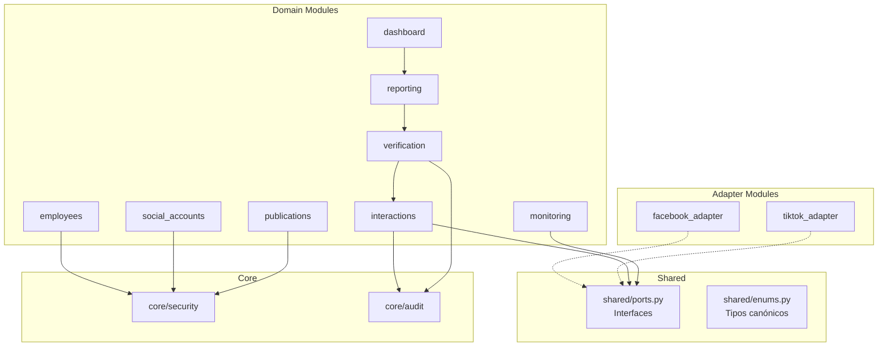
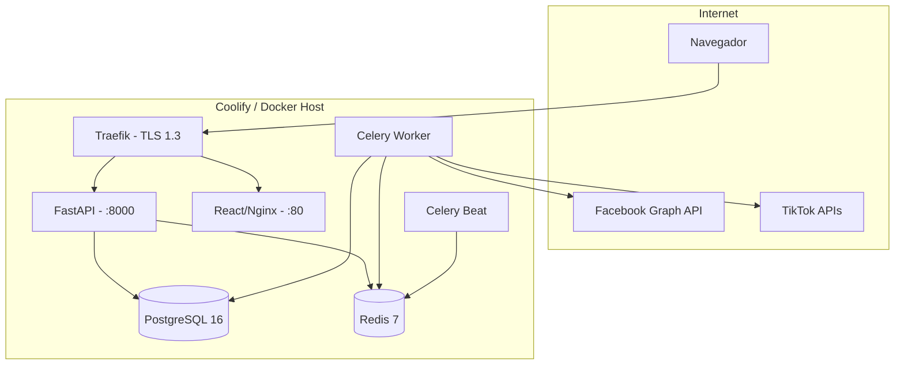

# GAMEA Social Monitor — Plan Arquitectónico y Tecnológico

<!--
  PLAN DE ARQUITECTURA TÉCNICA
  Proyecto: GAMEA Social Monitor
  Versión: 1.0.0
  Estado: APROBADO
  Fecha: 2026-09-17
  Constitución Referida: constitution.md v1.0.0
  Especificación Referida: spec.md v1.0.0
  Constitution Check: PASS (todos los principios)
-->

> [!IMPORTANT]
> Este plan se subordina a la [Constitución SDD v1.0.0](file:///f:/Documentos/GitHub/Control%20RRSS/.specify/memory/constitution.md) y a la [Especificación Funcional v1.0.0](file:///f:/Documentos/GitHub/Control%20RRSS/.specify/memory/spec.md). Toda decisión tecnológica ha sido verificada contra los requisitos constitucionales no negociables.

---

## 1. Stack Tecnológico

### 1.1 Backend

| Componente | Decisión | Justificación |
| :--- | :--- | :--- |
| **Lenguaje** | Python 3.12+ | Type hints + mypy para tipado estricto. Ecosistema maduro para Excel, HTTP clients, validación. |
| **Framework API** | FastAPI | API-first, OpenAPI 3.0 auto-generado (Principio XX). Async nativo para I/O bound. |
| **ORM** | SQLAlchemy 2.0+ | ORM con tipado, relaciones complejas, modo async. |
| **Migraciones** | Alembic | Migraciones versionadas con up/down (Principio XXI). |
| **Validación** | Pydantic v2 | Validación estricta de entradas, JSON Schema. |
| **Excel** | openpyxl | Generación nativa de .xlsx. |
| **HTTP Client** | httpx | Cliente async/sync para Graph API y TikTok API. |
| **Logging** | structlog | Logs estructurados JSON con correlation_id (Principio XXII). |

### 1.2 Frontend

| Componente | Decisión | Justificación |
| :--- | :--- | :--- |
| **Lenguaje** | TypeScript | Tipado estricto en compilación (Constitución §Arch.2). |
| **Framework** | React 19+ con Vite | Ecosistema maduro, builds rápidos. |
| **Tablas** | TanStack Table | Ordenamiento, filtrado, paginación. |
| **Gráficos** | Recharts o Chart.js | Tooltips para fichas técnicas de indicadores. |

### 1.3 Infraestructura

| Componente | Decisión | Justificación |
| :--- | :--- | :--- |
| **Base de Datos** | PostgreSQL 16+ | ACID, JSON, timestamps TZ, particionamiento. |
| **Broker / Caché** | Redis 7+ | Broker Celery, sesiones, rate limit counters. |
| **Tareas Async** | Celery 5+ con Redis | Scheduling, reintentos con backoff, DLQ, rate limits. |
| **Contenedores** | Docker (OCI) | Portabilidad total (Principio XXXII). |
| **Despliegue** | Docker Compose + Coolify | Dev local + PaaS self-hosted para producción. |
| **Reverse Proxy** | Traefik (Coolify) | TLS 1.3 automático con Let's Encrypt. |
| **Secretos** | Variables de entorno + Docker Secrets | Runtime injection (Principio XIII). |

### 1.4 Seguridad

| Componente | Decisión | Justificación |
| :--- | :--- | :--- |
| **Autenticación** | JWT (access + refresh) | Access 30min, refresh 8h (configurables). |
| **Hashing** | Argon2id | Resistente a GPU. Ganador PHC. |
| **Rate Limiting** | SlowAPI | Por IP y por usuario. |

---

## 2. Arquitectura del Sistema

### 2.1 Patrón: Modular Monolith

Conforme a la Constitución (§8 Arquitectura Evolutiva), el sistema adopta inicialmente un **Monolito Modular** con separación estricta entre capas y módulos lógicos.

```
Presentation (FastAPI Routers / Webhooks)
    ↕
Application Services (Use Cases / Service Layer)
    ↕
Domain Model (Entities / Business Rules / Enums)
    ↕
Infrastructure (SQLAlchemy Repos / External Adapters / Celery Tasks)
```

### 2.2 Estructura de Directorio

```
gamea-social-monitor/
├── docker-compose.yml
├── docker-compose.prod.yml
├── Dockerfile
├── Dockerfile.frontend
├── .env.example
├── alembic.ini
├── alembic/versions/
├── docs/
│   ├── constitution.md
│   ├── spec.md
│   ├── plan.md
│   ├── research.md
│   ├── data-model.md
│   ├── tasks.md
│   ├── quickstart.md
│   └── adr/
├── contracts/openapi.yaml
├── backend/
│   ├── main.py
│   ├── config.py
│   ├── dependencies.py
│   ├── database.py
│   ├── core/
│   │   ├── security/
│   │   ├── audit/
│   │   └── pagination.py
│   ├── modules/
│   │   ├── iam/
│   │   ├── employees/
│   │   ├── social_accounts/
│   │   ├── publications/
│   │   ├── facebook_adapter/
│   │   ├── tiktok_adapter/
│   │   ├── monitoring/
│   │   ├── interactions/
│   │   ├── verification/
│   │   ├── reporting/
│   │   ├── dashboard/
│   │   ├── notifications/
│   │   ├── admin/
│   │   └── shared/
│   │       ├── ports.py
│   │       ├── enums.py
│   │       └── exceptions.py
│   └── workers/
│       ├── celery_app.py
│       └── beat_schedule.py
├── frontend/src/
│   ├── api/
│   ├── components/
│   ├── pages/
│   ├── hooks/
│   ├── types/
│   └── utils/
└── scripts/
```

### 2.3 Regla de Dependencia entre Módulos



**Reglas:**
- Adaptadores (`facebook_adapter`, `tiktok_adapter`) implementan `shared/ports.py`.
- Módulos de dominio NEVER importan de adaptadores.
- `core/` es importado por todos los módulos.
- Dependencias entre dominios vía service layer, NEVER acceso directo a modelos de otro módulo.

---

## 3. Modelo de Datos Físico

### 3.1 Tablas (18 entidades)

| Tabla | PK | Propósito |
| :--- | :--- | :--- |
| `users` | UUID | Usuarios del sistema |
| `roles` | UUID | Roles RBAC (7 roles constitucionales) |
| `user_roles` | (user_id, role_id) | Asignación M:N |
| `permissions` | UUID | Permisos granulares por rol |
| `organizational_units` | UUID | Estructura jerárquica del GAMEA |
| `positions` | UUID | Cargos institucionales |
| `employees` | VARCHAR (employee_id) | Funcionarios con ID institucional inmutable |
| `employee_history` | UUID | Historial de cambios organizacionales |
| `social_platforms` | UUID | Catálogo de plataformas (FACEBOOK, TIKTOK) |
| `social_accounts` | UUID | Cuentas sociales vinculadas a funcionarios |
| `username_history` | UUID | Historial de cambios de username |
| `institutional_accounts` | UUID | Cuentas oficiales del GAMEA |
| `publications` | UUID | Publicaciones institucionales monitoreadas |
| `monitoring_campaigns` | UUID | Campañas de monitoreo |
| `campaign_publications` | (campaign_id, publication_id) | M:N campañas-publicaciones |
| `monitoring_targets` | UUID | Objetivos por unidad organizacional |
| `interactions` | UUID | Registro canónico de interacciones |
| `interaction_evidences` | UUID | Evidencias técnicas |
| `verifications` | UUID | Estado de verificación por funcionario |
| `external_sync_jobs` | UUID | Trabajos de sincronización |
| `report_executions` | UUID | Histórico de reportes emitidos |
| `audit_events` | UUID | Auditoría inmutable (append-only) |
| `system_configs` | UUID | Configuración externalizada |

### 3.2 Índices Críticos

```sql
-- Idempotencia de interacciones
CREATE UNIQUE INDEX idx_interactions_idempotency 
  ON interactions (platform_id, external_interaction_id) 
  WHERE external_interaction_id IS NOT NULL;

-- Cruce con funcionarios
CREATE INDEX idx_interactions_author 
  ON interactions (external_author_id) 
  WHERE external_author_id IS NOT NULL;

-- Consultas por publicación
CREATE INDEX idx_interactions_publication 
  ON interactions (publication_id, captured_at);

-- Lookup de cruce social
CREATE INDEX idx_social_accounts_lookup 
  ON social_accounts (external_user_id, platform_id);

-- Idempotencia de publicaciones
CREATE UNIQUE INDEX idx_publications_idempotency 
  ON publications (platform_id, external_post_id);

-- Auditoría por correlation
CREATE INDEX idx_audit_correlation 
  ON audit_events (correlation_id);

-- Auditoría temporal
CREATE INDEX idx_audit_temporal 
  ON audit_events (timestamp_utc, entity_name);
```

### 3.3 Restricciones Especiales

```sql
-- Tabla audit_events: append-only (bloquear UPDATE y DELETE)
CREATE OR REPLACE FUNCTION prevent_audit_mutation()
RETURNS TRIGGER AS $$
BEGIN
  RAISE EXCEPTION 'audit_events table is append-only. UPDATE and DELETE are prohibited.';
END;
$$ LANGUAGE plpgsql;

CREATE TRIGGER trg_audit_no_update
  BEFORE UPDATE OR DELETE ON audit_events
  FOR EACH ROW EXECUTE FUNCTION prevent_audit_mutation();
```

- Todos los timestamps: `TIMESTAMP WITH TIME ZONE` en UTC.
- `employees.document_number_encrypted`: cifrado a nivel de aplicación (Fernet/AES-256) con clave rotable.

---

## 4. Contratos API

### 4.1 Estructura de Endpoints

| Módulo | Prefijo | Métodos Principales |
| :--- | :--- | :--- |
| Auth | `/api/v1/auth` | `POST /login`, `POST /refresh`, `POST /logout`, `GET /me` |
| Users | `/api/v1/users` | CRUD, `PATCH /{id}/roles` |
| Employees | `/api/v1/employees` | CRUD, `POST /import`, `GET /{id}/history` |
| Org Units | `/api/v1/org-units` | CRUD jerárquico, `GET /tree` |
| Social Accounts | `/api/v1/social-accounts` | CRUD, `POST /bind`, `POST /unbind` |
| Publications | `/api/v1/publications` | CRUD, filtros por campaña y plataforma |
| Campaigns | `/api/v1/campaigns` | CRUD, `POST /{id}/publications`, `GET /{id}/targets` |
| Interactions | `/api/v1/interactions` | `GET` (filtros), `GET /{id}/evidence` |
| Verifications | `/api/v1/verifications` | `POST /manual`, `GET /pending`, `GET /summary` |
| Reports | `/api/v1/reports` | `POST /generate`, `GET /`, `GET /{id}/download` |
| Dashboard | `/api/v1/dashboard` | `GET /operational`, `GET /executive` |
| Sync Jobs | `/api/v1/sync-jobs` | `GET /`, `POST /trigger` |
| Audit | `/api/v1/audit` | `GET /events` (filtros), `GET /export` |
| Config | `/api/v1/config` | `GET /`, `PATCH /{key}` |
| Health | `/health` | `GET /liveness`, `GET /readiness` |
| Webhooks | `/webhooks/facebook` | `GET` (verificación), `POST` (payload) |

### 4.2 Convenciones

- Versionado: `/api/v1/` (v2 en paralelo cuando existan breaking changes).
- Auth: `Authorization: Bearer <JWT>` en todos excepto `/health/*` y `/webhooks/*`.
- Errores: JSON con `{ "detail": "...", "code": "...", "correlation_id": "..." }`.
- Paginación: `?page=1&page_size=20` con respuesta `{ "items": [], "total": N, "page": N, "pages": N }`.

---

## 5. Arquitectura de Despliegue

### 5.1 Diagrama



### 5.2 Ambientes (Principio XXXV)

| Ambiente | Propósito | Base de Datos | Credenciales API |
| :--- | :--- | :--- | :--- |
| Development | Desarrollo local | PostgreSQL local (Docker) | Fakes/Mocks |
| Testing | CI pipeline | PostgreSQL efímero (testcontainers) | Fakes |
| Staging | Aceptación institucional | PostgreSQL staging (datos anonimizados) | Sandbox Facebook/TikTok |
| Production | Operación oficial GAMEA | PostgreSQL producción (cifrado) | Tokens reales |

### 5.3 Backups (Principio XXXIII)

- `pg_dump` automático diario vía Celery Beat.
- Cifrado AES-256 del dump antes de almacenamiento.
- Almacenamiento desacoplado (S3-compatible o Coolify backups).
- RPO: 24 horas. RTO: 4 horas.
- Verificación trimestral de restauración.

---

## 6. Pipeline CI/CD (Principio XXXIV)

### Quality Gates

| # | Gate | Herramienta | Criterio |
| :--- | :--- | :--- | :--- |
| 1 | Linting Python | `ruff` | 0 errores |
| 2 | Type Check Python | `mypy --strict` | 0 errores |
| 3 | Linting Frontend | `eslint` + `tsc --noEmit` | 0 errores |
| 4 | Unit Tests | `pytest` | 100% pass, ≥80% coverage dominio |
| 5 | Integration Tests | `pytest` + testcontainers | 100% pass |
| 6 | Contract Tests | `pytest` con fakes FB/TK | 100% pass |
| 7 | Migration Tests | `alembic upgrade/downgrade` en BD vacía | Limpio |
| 8 | Secret Scan | `gitleaks` | 0 secretos |
| 9 | Dependency Audit | `pip-audit` + `npm audit` | 0 CRITICAL/HIGH |

---

## 7. Constitution Check

| Principio | Estado |
| :--- | :--- |
| I. Specification First | `PASS` |
| III. Privacy by Design | `PASS` |
| IV. APIs Oficiales | `PASS` |
| V. No Inventar Datos | `PASS` |
| VII. Identidad Única | `PASS` |
| IX. Modelo Normalizado | `PASS` |
| XI-XII. Modularidad y Desacoplamiento | `PASS` |
| XVI-XVII. Seguridad y RBAC | `PASS` |
| XIX. Testing | `PASS` |
| XXIII. Estados de Sincronización | `PASS` |
| XXVII. No Rankings | `PASS` |

**Resultado: TODOS `PASS`. Plan conforme a la Constitución SDD v1.0.0.**

---

## Metadata

* **Versión:** 1.0.0
* **Estado:** APROBADO
* **Fecha:** 2026-09-17
* **Constitución:** v1.0.0
* **Especificación:** v1.0.0
* **ADRs propuestos:** 6 (Backend, Frontend, Database, Auth, Deployment, Backups)
