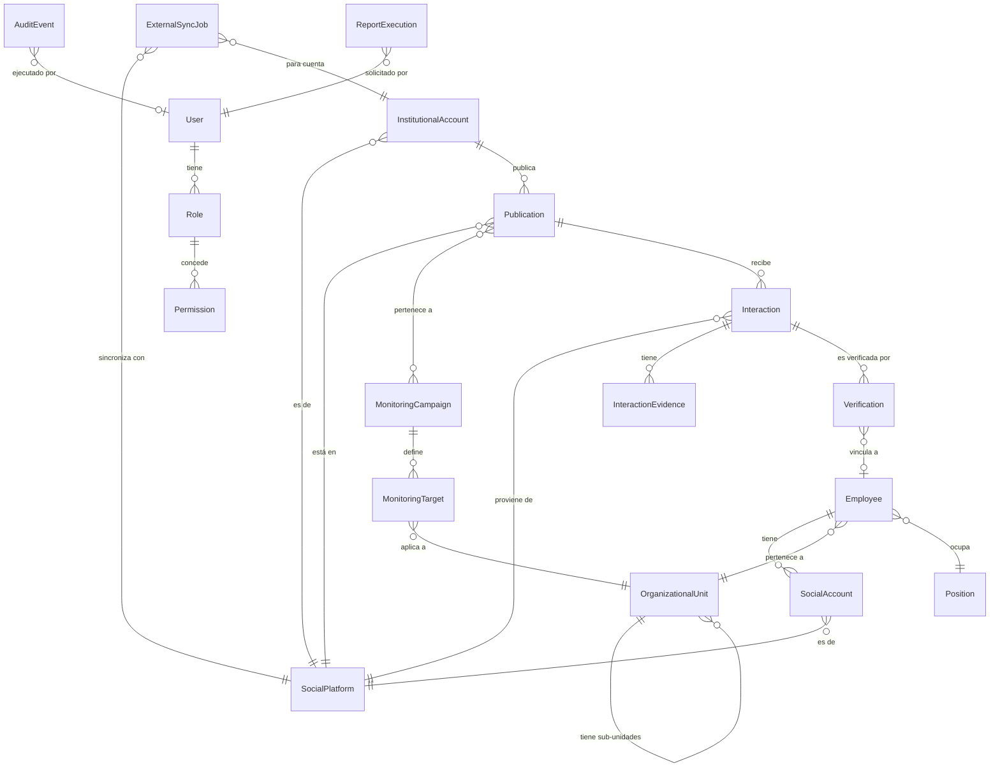

# GAMEA Social Monitor — Functional Specification

<!--
  ESPECIFICACIÓN FUNCIONAL DEL SISTEMA
  Proyecto: Control RRSS — Plataforma Institucional de Monitoreo y Analítica
             de Interacciones en Redes Sociales del GAMEA
  Nombre Corto: GAMEA Social Monitor
  Versión: 1.0.0
  Estado: BORRADOR PARA REVISIÓN
  Fecha: 2026-09-17
  Constitución Referida: constitution.md v1.0.0
  Investigación de APIs: research.md v1.0.0
-->

> [!IMPORTANT]
> **JERARQUÍA NORMATIVA**
> La presente especificación se subordina íntegramente a la [Constitución SDD v1.0.0](file:///f:/Documentos/GitHub/Control%20RRSS/.specify/memory/constitution.md). En caso de conflicto, prevalecen los principios constitucionales. Toda incertidumbre está marcada explícitamente con `RESEARCH_REQUIRED`, `LEGAL_REVIEW_REQUIRED`, `NEEDS_CLARIFICATION` o `ARCHITECTURE_DECISION_REQUIRED`.

---

## Table of Contents

1. [Visión General del Sistema](#1-visión-general-del-sistema)
2. [Actores del Sistema](#2-actores-del-sistema)
3. [Restricciones de APIs Externas](#3-restricciones-de-apis-externas)
4. [Módulo 1 — Identity & Access Management (IAM)](#módulo-1--identity--access-management-iam)
5. [Módulo 2 — Employee Directory & Organization](#módulo-2--employee-directory--organization)
6. [Módulo 3 — Social Account Binding](#módulo-3--social-account-binding)
7. [Módulo 4 — Institutional Publishing Catalog](#módulo-4--institutional-publishing-catalog)
8. [Módulo 5 — Facebook Integration Adapter](#módulo-5--facebook-integration-adapter)
9. [Módulo 6 — TikTok Integration Adapter](#módulo-6--tiktok-integration-adapter)
10. [Módulo 7 — Monitoring & Orchestration Engine](#módulo-7--monitoring--orchestration-engine)
11. [Módulo 8 — Interaction Processing & Evidence](#módulo-8--interaction-processing--evidence)
12. [Módulo 9 — Verification & Business Rules](#módulo-9--verification--business-rules)
13. [Módulo 10 — Reporting & Analytics Engine](#módulo-10--reporting--analytics-engine)
14. [Módulo 11 — Operational & Executive Dashboard](#módulo-11--operational--executive-dashboard)
15. [Módulo 12 — System Notifications](#módulo-12--system-notifications)
16. [Módulo 13 — Security & Audit Trail](#módulo-13--security--audit-trail)
17. [Módulo 14 — System Administration & Configuration](#módulo-14--system-administration--configuration)
18. [Entidades de Dominio y Relaciones](#18-entidades-de-dominio-y-relaciones)
19. [Matriz de Trazabilidad Constitucional](#19-matriz-de-trazabilidad-constitucional)
20. [Glosario](#20-glosario)

---

## 1. Visión General del Sistema

### 1.1 Problema Institucional

El Gobierno Autónomo Municipal de El Alto (GAMEA) realiza el seguimiento manual de las interacciones de sus funcionarios en publicaciones institucionales de Facebook y TikTok. El proceso actual se basa en la revisión individual de perfiles y el registro manual en archivos Excel, lo que produce:

* Elevada carga operativa sobre el personal de comunicaciones.
* Duplicación e inconsistencia de información.
* Errores humanos frecuentes en el registro.
* Imposibilidad de obtener información consolidada en tiempo real.
* Ausencia de trazabilidad y auditoría de las verificaciones realizadas.
* Dificultad para generar reportes ejecutivos y análisis históricos.
* Inexistencia de un dashboard centralizado.

### 1.2 Propósito del Sistema

GAMEA Social Monitor es una plataforma institucional que centraliza, organiza, automatiza (donde las APIs oficiales lo permitan) y reporta la información de interacciones de funcionarios en publicaciones institucionales del GAMEA en redes sociales.

### 1.3 Alcance Funcional

El sistema abarcará:
1. Administración y sincronización de funcionarios desde una fuente maestra de RR.HH.
2. Vinculación controlada de cuentas de Facebook y TikTok de funcionarios.
3. Administración de cuentas institucionales del GAMEA.
4. Identificación y registro de publicaciones institucionales.
5. Obtención automatizada de datos mediante APIs oficiales (donde sea posible).
6. Registro de comentarios y otras interacciones verificables.
7. Diferenciación semántica explícita de estados de verificación.
8. Consolidación automática de información.
9. Generación de reportes Excel reproducibles.
10. Construcción de dashboards operativos y ejecutivos.
11. Consulta histórica de información.
12. Auditoría inmutable de operaciones.
13. Gestión de usuarios, permisos y roles RBAC.
14. Preparación para integración futura con fuentes institucionales de RR.HH.
15. Diseño extensible para incorporar nuevas redes sociales.

### 1.4 Fuera de Alcance

El sistema **MUST NOT**:
* Funcionar como sistema de gestión de Recursos Humanos.
* Generar rankings, scoring individual ni evaluaciones de desempeño (Principio XXVII).
* Monitorear actividad personal de funcionarios fuera de publicaciones institucionales (Principio III).
* Utilizar scraping, automatización de navegador ni métodos no autorizados (Principio IV).
* Publicar contenido en redes sociales en nombre del GAMEA (fuera de alcance inicial).

---

## 2. Actores del Sistema

| Actor | Descripción | Rol RBAC Correspondiente |
| :--- | :--- | :--- |
| **Super Administrador** | Responsable técnico máximo con control total sobre infraestructura, auditoría y gestión de roles. | `Super Administrator` |
| **Administrador de Sistema** | Técnico de la DTIC que configura conectores, parámetros y mantenimiento del sistema. | `System Administrator` |
| **Administrador de Comunicaciones** | Responsable de comunicación institucional; gestiona campañas, cuentas institucionales y objetivos de monitoreo. | `Communications Administrator` |
| **Analista** | Operador que genera reportes, analiza interacciones, realiza verificaciones manuales y consultas operativas. | `Analyst` |
| **Auditor** | Revisor independiente con acceso de lectura a trazas de auditoría y verificación. | `Auditor` |
| **Visor Ejecutivo** | Directivo con acceso a dashboards ejecutivos consolidados sin acceso a PII de funcionarios. | `Read Only` |
| **Servicio de Integración** | Cuenta técnica de máquina para comunicación con sistemas de RR.HH. | `Integration Service` |
| **Facebook Graph API** | Sistema externo de Meta que provee datos de publicaciones y comentarios. | — (Actor externo) |
| **TikTok Developer API** | Sistema externo de TikTok que provee métricas de videos institucionales. | — (Actor externo) |
| **Sistema de RR.HH. del GAMEA** | Fuente maestra de la nómina de funcionarios. | — (Actor externo) |

---

## 3. Restricciones de APIs Externas

> [!WARNING]
> **RESTRICCIONES TÉCNICAS DOCUMENTADAS**
> Los hallazgos detallados se encuentran en [research.md](file:///f:/Documentos/GitHub/Control%20RRSS/.specify/memory/research.md). Las siguientes restricciones tienen impacto directo en los módulos 5, 6, 8 y 9 de esta especificación.

### 3.1 Matriz de Capacidades Verificadas

| Capacidad | Facebook (Graph API v26.0) | TikTok (Developer APIs) |
| :--- | :--- | :--- |
| Listar publicaciones institucionales | ✅ `VERIFIED` | ✅ `VERIFIED` (Display API, videos propios) |
| Obtener texto/contenido | ✅ `VERIFIED` | ✅ `VERIFIED` |
| Leer comentarios | ✅ `VERIFIED` (con restricciones de identidad) | 🚫 `API_RESTRICTED` |
| Identificar autor del comentario | ⚠️ `PARTIAL` (campo `from` limitado) | 🚫 `API_RESTRICTED` |
| Verificar Like/Reacción individual | 🚫 `API_RESTRICTED` (solo conteos) | 🚫 `API_RESTRICTED` (solo conteos) |
| Verificar Share individual | 🚫 `API_RESTRICTED` (solo conteos) | 🚫 `API_RESTRICTED` (solo conteos) |
| Métricas agregadas | ✅ `VERIFIED` (Insights + Reactions) | ✅ `VERIFIED` (Display API básicas) |
| Webhooks en tiempo real | ✅ `VERIFIED` (feed de Página) | ⚠️ `RESEARCH_REQUIRED` |

### 3.2 Modelo de Verificación Resultante

El sistema implementará **tres niveles de verificación** derivados de las restricciones de API:

1. **Verificación Automática:** Cruce automático de comentarios en Facebook cuando la API retorne identidad del autor → Estado: `CONFIRMED` / `NOT_FOUND`.
2. **Observación Agregada:** Captura de métricas numéricas globales (conteos de likes, shares, comentarios) en ambas plataformas → Estado: `OBSERVED`.
3. **Verificación Manual Asistida:** El operador revisa visualmente la interacción y registra la evidencia en el sistema → Estado: `DECLARED`.

---

## Módulo 1 — Identity & Access Management (IAM)

> **Bounded Context:** Gestión de identidad, autenticación y autorización de los usuarios de la plataforma.
> **Principios Constitucionales:** XVI (Seguridad por Diseño), XVII (RBAC en Backend).

### REQ-IAM-001 — Autenticación de Usuarios
* **Descripción:** El sistema MUST autenticar a los usuarios mediante credenciales seguras antes de conceder acceso a cualquier funcionalidad.
* **Reglas de Negocio:**
  * BR-IAM-001: Los tokens de sesión MUST tener expiración configurable (por defecto ≤ 8 horas).
  * BR-IAM-002: Tras 5 intentos de autenticación fallidos consecutivos, la cuenta MUST bloquearse temporalmente por un período configurable (por defecto 15 minutos).
  * BR-IAM-003: Las contraseñas MUST almacenarse mediante algoritmos de hashing seguros con salt (ej. bcrypt, Argon2). `ARCHITECTURE_DECISION_REQUIRED`
  * BR-IAM-004: Las contraseñas MUST cumplir una política de complejidad mínima configurable (longitud mínima 12 caracteres, combinación de mayúsculas, minúsculas, números y caracteres especiales).
* **Criterios de Aceptación:**
  * **Given** un usuario con credenciales válidas, **When** intenta iniciar sesión, **Then** el sistema emite un token de sesión con expiración y registra un evento de auditoría `LOGIN/SUCCESS`.
  * **Given** un usuario con credenciales inválidas, **When** intenta iniciar sesión, **Then** el sistema rechaza el acceso, incrementa el contador de intentos fallidos y registra `LOGIN/DENIED`.
  * **Given** un usuario que ha alcanzado 5 intentos fallidos, **When** intenta iniciar sesión nuevamente, **Then** el sistema bloquea la cuenta temporalmente y registra `ACCOUNT_LOCKED`.

### REQ-IAM-002 — Gestión de Roles RBAC
* **Descripción:** El sistema MUST implementar un modelo de Control de Acceso Basado en Roles (RBAC) con los 7 roles definidos en el Principio XVII constitucional.
* **Roles:**
  * `SUPER_ADMIN`: Control total.
  * `SYS_ADMIN`: Configuración técnica de conectores y parámetros.
  * `COMM_ADMIN`: Gestión de campañas, cuentas institucionales, vinculaciones.
  * `ANALYST`: Generación y análisis de reportes, verificaciones manuales.
  * `AUDITOR`: Lectura de registros de auditoría y trazas.
  * `READ_ONLY`: Visualización de dashboards ejecutivos sin acceso a PII.
  * `INTEGRATION_SERVICE`: Credencial técnica M2M.
* **Reglas de Negocio:**
  * BR-IAM-005: Toda verificación de permisos MUST realizarse en la capa de backend.
  * BR-IAM-006: Ocultar un elemento en la UI MUST NOT considerarse control de acceso.
  * BR-IAM-007: Un usuario MUST tener asignado al menos un rol para acceder al sistema.
  * BR-IAM-008: Solo `SUPER_ADMIN` puede asignar o revocar roles.
* **Criterios de Aceptación:**
  * **Given** un usuario con rol `ANALYST`, **When** intenta acceder a un endpoint de administración de roles, **Then** el sistema responde `403 Forbidden` y registra un evento `ACCESS_DENIED`.
  * **Given** un usuario con rol `READ_ONLY`, **When** consulta el dashboard ejecutivo, **Then** el sistema presenta los indicadores sin exponer nombres, cédulas ni identificadores de funcionarios individuales.

### REQ-IAM-003 — Gestión de Usuarios
* **Descripción:** El sistema MUST permitir crear, modificar, desactivar y consultar usuarios del sistema.
* **Reglas de Negocio:**
  * BR-IAM-009: Los usuarios MUST NOT eliminarse físicamente; su estado pasa a `DESACTIVADO` preservando el historial de auditoría.
  * BR-IAM-010: Todo cambio en usuarios MUST generar un evento de auditoría.
* **Criterios de Aceptación:**
  * **Given** un Super Administrador, **When** crea un nuevo usuario, **Then** el sistema asigna un ID interno único, almacena la contraseña de forma segura y registra `USER_CREATE/SUCCESS`.

### REQ-IAM-004 — Gestión de Sesiones
* **Descripción:** El sistema MUST gestionar sesiones activas con expiración controlada y capacidad de revocación.
* **Reglas de Negocio:**
  * BR-IAM-011: Las sesiones inactivas MUST expirar tras un período configurable (por defecto 30 minutos de inactividad).
  * BR-IAM-012: El `SUPER_ADMIN` MUST poder revocar sesiones activas de cualquier usuario.
  * BR-IAM-013: Al cambiar la contraseña, todas las sesiones previas del usuario MUST invalidarse.

---

## Módulo 2 — Employee Directory & Organization

> **Bounded Context:** Gestión del directorio de funcionarios, estructura organizacional y cargos.
> **Principios Constitucionales:** VII (Identidad Única), VIII (Fuente Maestra RR.HH.), IX (Modelo Normalizado).

### REQ-EMP-001 — Registro de Funcionarios con Identidad Única
* **Descripción:** El sistema MUST registrar funcionarios utilizando un identificador institucional único e inmutable como clave primaria.
* **Atributos Mínimos:**
  * `employee_id`: Identificador institucional único (inmutable). **Clave primaria.**
  * `document_number`: Número de documento de identidad (cifrado en reposo). Clasificación: `CONFIDENTIAL`.
  * `first_name`, `last_name`: Nombres y apellidos. Clasificación: `CONFIDENTIAL`.
  * `organizational_unit_id`: FK a la unidad organizacional actual.
  * `position_id`: FK al cargo actual.
  * `status`: Estado del funcionario (`ACTIVE`, `ON_LEAVE`, `INACTIVE`, `TERMINATED`).
  * `hire_date`: Fecha de ingreso a la institución.
  * `termination_date`: Fecha de desvinculación (nullable).
  * `created_at`: Timestamp UTC de creación del registro.
  * `updated_at`: Timestamp UTC de última actualización.
* **Reglas de Negocio:**
  * BR-EMP-001: El `employee_id` MUST ser inmutable tras la creación. MUST NOT reutilizarse.
  * BR-EMP-002: Los funcionarios MUST NOT identificarse por nombre visible, username de red social ni enlace de perfil.
  * BR-EMP-003: Los funcionarios con estado `TERMINATED` MUST conservar íntegro su historial de interacciones pasadas.
  * BR-EMP-004: Los funcionarios MUST NOT eliminarse físicamente de la base de datos.
* **Criterios de Aceptación:**
  * **Given** un nuevo funcionario con `employee_id` único, **When** se registra en el sistema, **Then** se crea un registro con estado `ACTIVE`, timestamp UTC de creación y evento de auditoría `EMPLOYEE_CREATE/SUCCESS`.
  * **Given** un funcionario existente, **When** se intenta modificar su `employee_id`, **Then** el sistema rechaza la operación con error `IMMUTABLE_FIELD`.

### REQ-EMP-002 — Estructura Organizacional
* **Descripción:** El sistema MUST modelar la estructura organizacional del GAMEA como entidades independientes de los funcionarios.
* **Entidad `OrganizationalUnit`:**
  * `unit_id`: Identificador único.
  * `name`: Nombre de la unidad (ej. "Secretaría Municipal de Comunicación Social").
  * `code`: Código institucional corto.
  * `parent_unit_id`: FK a unidad superior (nullable para nodo raíz). Permite jerarquía.
  * `status`: `ACTIVE` / `INACTIVE`.
* **Entidad `Position`:**
  * `position_id`: Identificador único.
  * `title`: Denominación del cargo.
  * `unit_id`: FK a la unidad organizacional.
  * `status`: `ACTIVE` / `INACTIVE`.
* **Reglas de Negocio:**
  * BR-EMP-005: Las unidades organizacionales MUST soportar relaciones jerárquicas (árbol).
  * BR-EMP-006: La eliminación de una unidad MUST validar que no existan funcionarios activos asignados.

### REQ-EMP-003 — Importación de Nómina desde Fuente Maestra
* **Descripción:** El sistema MUST permitir la importación periódica de la nómina de funcionarios desde una fuente maestra de RR.HH. Inicialmente mediante archivo estructurado (Excel/CSV) con formato predefinido. En el futuro, mediante integración API directa.
* **Reglas de Negocio:**
  * BR-EMP-007: La importación MUST ser idempotente: ejecutar la misma importación dos veces MUST NOT generar duplicados.
  * BR-EMP-008: La importación MUST detectar y reportar:
    * Funcionarios nuevos (altas).
    * Funcionarios removidos de la fuente (bajas → marcar como `TERMINATED`).
    * Cambios de unidad organizacional (transferencias).
    * Cambios de cargo.
  * BR-EMP-009: Toda importación MUST generar un registro de sincronización con: fecha, usuario ejecutor, archivo origen, hash del archivo, total procesados, altas, bajas, cambios, errores.
  * BR-EMP-010: Los errores de validación en filas individuales MUST NOT abortar la importación completa; MUST reportarse individualmente.
* **Criterios de Aceptación:**
  * **Given** un archivo Excel con 100 funcionarios, 3 nuevos y 2 dados de baja, **When** se ejecuta la importación, **Then** el sistema crea 3 registros nuevos como `ACTIVE`, marca 2 como `TERMINATED`, preserva sus historiales y genera un reporte de sincronización.
  * **Given** el mismo archivo importado dos veces, **When** se ejecuta la segunda importación, **Then** el sistema reporta cero cambios y no duplica registros.

### REQ-EMP-004 — Historial de Cambios Organizacionales
* **Descripción:** El sistema MUST mantener un historial inmutable de todos los cambios organizacionales de un funcionario (transferencias, promociones, bajas).
* **Reglas de Negocio:**
  * BR-EMP-011: Cada cambio de `organizational_unit_id`, `position_id` o `status` MUST registrarse como una entrada histórica con `effective_date`, `previous_value` y `new_value`.

---

## Módulo 3 — Social Account Binding

> **Bounded Context:** Vinculación y gestión de cuentas de redes sociales asociadas a funcionarios.
> **Principios Constitucionales:** VII (Identidad Única), III (Privacidad).

### REQ-SAB-001 — Vinculación de Cuenta Social a Funcionario
* **Descripción:** El sistema MUST permitir vincular una o más cuentas de redes sociales a un funcionario registrado.
* **Atributos de `SocialAccount`:**
  * `social_account_id`: Identificador interno único (PK).
  * `employee_id`: FK al funcionario.
  * `platform_id`: FK a la plataforma (`FACEBOOK`, `TIKTOK`).
  * `external_user_id`: Identificador externo del usuario en la red social (cuando esté disponible). Clasificación: `CONFIDENTIAL`.
  * `current_username`: Nombre de usuario o handle actual visible en la red social.
  * `profile_url`: URL del perfil público (cuando sea aplicable).
  * `binding_status`: `ACTIVE`, `SUSPENDED`, `UNLINKED`.
  * `bound_at`: Timestamp UTC de vinculación.
  * `bound_by_user_id`: FK al usuario del sistema que realizó la vinculación.
  * `unlinked_at`: Timestamp UTC de desvinculación (nullable).
* **Reglas de Negocio:**
  * BR-SAB-001: Una cuenta social MUST NOT estar vinculada simultáneamente a dos funcionarios distintos.
  * BR-SAB-002: Un funcionario MAY tener múltiples cuentas sociales (una por plataforma o varias en la misma plataforma).
  * BR-SAB-003: Solo los roles `COMM_ADMIN` y `SUPER_ADMIN` MUST poder crear o modificar vinculaciones.
  * BR-SAB-004: La vinculación MUST generar un evento de auditoría.
* **Criterios de Aceptación:**
  * **Given** un funcionario `ACTIVE` sin cuenta de Facebook vinculada, **When** el Administrador de Comunicaciones registra su cuenta de Facebook, **Then** se crea un registro `SocialAccount` con estado `ACTIVE` y se registra auditoría `SOCIAL_ACCOUNT_BIND/SUCCESS`.
  * **Given** una cuenta de Facebook ya vinculada al funcionario A, **When** se intenta vincular la misma cuenta al funcionario B, **Then** el sistema rechaza la operación con error `ACCOUNT_ALREADY_BOUND`.

### REQ-SAB-002 — Historial de Cambios de Username
* **Descripción:** El sistema MUST rastrear los cambios de nombre de usuario (username/handle) en las cuentas sociales vinculadas.
* **Reglas de Negocio:**
  * BR-SAB-005: Un cambio de username MUST NOT romper la vinculación ni el historial del funcionario (Principio VII).
  * BR-SAB-006: El historial de usernames MUST conservarse para referencia y auditoría.
* **Criterios de Aceptación:**
  * **Given** un funcionario con username de Facebook "juan.perez", **When** el username cambia a "jperez.oficial", **Then** el sistema actualiza `current_username`, crea un registro en el historial con el username anterior y la fecha del cambio, y preserva íntegro todo el historial de interacciones previas.

### REQ-SAB-003 — Desvinculación de Cuenta Social
* **Descripción:** El sistema MUST permitir desvincular una cuenta social de un funcionario sin perder el historial de interacciones asociadas.
* **Reglas de Negocio:**
  * BR-SAB-007: La desvinculación cambia `binding_status` a `UNLINKED` y registra `unlinked_at`. MUST NOT eliminar físicamente el registro ni las interacciones históricas asociadas.
  * BR-SAB-008: Tras la desvinculación, las interacciones futuras de esa cuenta MUST NOT cruzarse automáticamente con el funcionario.

---

## Módulo 4 — Institutional Publishing Catalog

> **Bounded Context:** Gestión de cuentas institucionales del GAMEA y publicaciones objeto de monitoreo.
> **Principios Constitucionales:** IV (APIs Oficiales), VI (Proveniencia).

### REQ-PUB-001 — Registro de Cuentas Institucionales del GAMEA
* **Descripción:** El sistema MUST permitir registrar y administrar las cuentas oficiales del GAMEA en las diferentes plataformas sociales.
* **Atributos de `InstitutionalAccount`:**
  * `institutional_account_id`: PK interno.
  * `platform_id`: FK a la plataforma (`FACEBOOK`, `TIKTOK`).
  * `external_page_id`: Identificador externo de la página/perfil institucional.
  * `account_name`: Nombre visible de la cuenta.
  * `account_url`: URL pública.
  * `status`: `ACTIVE`, `SUSPENDED`, `ARCHIVED`.
  * `connection_status`: Estado de la conexión API (`CONNECTED`, `TOKEN_EXPIRED`, `NOT_CONFIGURED`).
* **Reglas de Negocio:**
  * BR-PUB-001: Solo `SYS_ADMIN` y `SUPER_ADMIN` pueden configurar conexiones API de cuentas institucionales.
  * BR-PUB-002: Solo `COMM_ADMIN`, `SYS_ADMIN` y `SUPER_ADMIN` pueden registrar cuentas institucionales.

### REQ-PUB-002 — Registro de Publicaciones Institucionales
* **Descripción:** El sistema MUST permitir registrar publicaciones institucionales como objetos de monitoreo. Las publicaciones de Facebook SHOULD capturarse automáticamente vía API/Webhooks. Las publicaciones de TikTok SHOULD capturarse vía Display API cuando sea posible, o registrarse manualmente.
* **Atributos de `Publication`:**
  * `publication_id`: PK interno.
  * `institutional_account_id`: FK a la cuenta institucional emisora.
  * `external_post_id`: Identificador externo de la publicación en la red social.
  * `platform_id`: FK a la plataforma.
  * `content_text`: Texto de la publicación (cuando esté disponible).
  * `content_type`: `TEXT`, `IMAGE`, `VIDEO`, `LINK`, `MIXED`.
  * `external_url`: URL pública de la publicación.
  * `published_at`: Timestamp UTC de publicación según la red social.
  * `captured_at`: Timestamp UTC de captura en el sistema.
  * `capture_method`: `WEBHOOK`, `API_POLLING`, `MANUAL`.
  * `monitoring_status`: `ACTIVE`, `PAUSED`, `COMPLETED`, `ARCHIVED`.
  * `api_version`: Versión de la API utilizada en la captura.
* **Reglas de Negocio:**
  * BR-PUB-003: Una publicación MUST tener un `external_post_id` único por plataforma para garantizar idempotencia en la captura.
  * BR-PUB-004: Las publicaciones MUST NOT eliminarse físicamente; se archivan manteniendo historial.
* **Criterios de Aceptación:**
  * **Given** un webhook de Facebook que notifica una nueva publicación en la página del GAMEA, **When** el sistema procesa el webhook, **Then** se crea un registro `Publication` con todos los metadatos de proveniencia, `capture_method=WEBHOOK`, estado `ACTIVE`, y no se duplica si el mismo webhook se recibe múltiples veces.

### REQ-PUB-003 — Campañas de Monitoreo
* **Descripción:** El sistema MUST permitir agrupar publicaciones en campañas de monitoreo con períodos definidos.
* **Atributos de `MonitoringCampaign`:**
  * `campaign_id`: PK interno.
  * `name`: Nombre descriptivo de la campaña.
  * `description`: Descripción del propósito.
  * `start_date`: Fecha de inicio.
  * `end_date`: Fecha de cierre.
  * `status`: `DRAFT`, `ACTIVE`, `COMPLETED`, `ARCHIVED`.
  * `created_by_user_id`: FK al usuario creador.
* **Reglas de Negocio:**
  * BR-PUB-005: Una publicación MAY pertenecer a múltiples campañas (relación M:N).
  * BR-PUB-006: Solo `COMM_ADMIN` y `SUPER_ADMIN` pueden crear/modificar campañas.
  * BR-PUB-007: Al completar una campaña, sus publicaciones pasan a `COMPLETED` pero permanecen consultables.

### REQ-PUB-004 — Objetivos de Monitoreo por Unidad Organizacional
* **Descripción:** El sistema MUST permitir definir objetivos de interacción por unidad organizacional para una campaña determinada.
* **Atributos de `MonitoringTarget`:**
  * `target_id`: PK interno.
  * `campaign_id`: FK a la campaña.
  * `organizational_unit_id`: FK a la unidad organizacional.
  * `publication_id`: FK a la publicación (nullable si aplica a toda la campaña).
  * `target_interaction_types`: Tipos de interacción esperados (`COMMENT`, `REACTION`, `SHARE`).
  * `notes`: Observaciones adicionales.
* **Reglas de Negocio:**
  * BR-PUB-008: Los objetivos MUST NOT definir valores numéricos de scoring ni porcentajes de cumplimiento mínimo (Principio XXVII). Son informativos, no punitivos.

---

## Módulo 5 — Facebook Integration Adapter

> **Bounded Context:** Adaptador de integración con Meta Graph API para la obtención de datos de Facebook.
> **Principios Constitucionales:** IV (APIs Oficiales), XII (Integraciones Desacopladas), XIII (Versionado), XIV (Resiliencia), XV (Idempotencia).
> **Investigación de referencia:** [research.md §1](file:///f:/Documentos/GitHub/Control%20RRSS/.specify/memory/research.md)

### REQ-FBI-001 — Configuración de Conexión con Graph API
* **Descripción:** El sistema MUST permitir configurar la conexión con Facebook Graph API mediante Page Access Token.
* **Reglas de Negocio:**
  * BR-FBI-001: El Page Access Token MUST almacenarse en un almacén de secretos, MUST NOT persistirse en base de datos de aplicación ni en código fuente (Principio XIII).
  * BR-FBI-002: El sistema MUST registrar la versión de Graph API utilizada (actualmente v26.0) en cada operación.
  * BR-FBI-003: El sistema MUST validar los permisos otorgados (`pages_read_engagement`, `pages_read_user_content`, `pages_manage_metadata`) antes de ejecutar operaciones masivas.
  * BR-FBI-004: Ante un token expirado o revocado, el sistema MUST cambiar el estado de la conexión a `TOKEN_EXPIRED`, suspender sincronizaciones automáticas y emitir una notificación de alta prioridad.

### REQ-FBI-002 — Obtención de Publicaciones de Página
* **Descripción:** El sistema MUST obtener las publicaciones de la Página institucional del GAMEA en Facebook, tanto por polling programado como por webhooks.
* **Endpoints utilizados:** `GET /{page-id}/published_posts` y webhook `feed`.
* **Reglas de Negocio:**
  * BR-FBI-005: La captura MUST ser idempotente: el mismo `external_post_id` no genera duplicados.
  * BR-FBI-006: La frecuencia de polling MUST ser configurable (valor por defecto: cada 15 minutos).

### REQ-FBI-003 — Obtención de Comentarios de Publicaciones
* **Descripción:** El sistema MUST obtener los comentarios de las publicaciones monitoreadas mediante la Graph API.
* **Endpoint utilizado:** `GET /{post-id}/comments`
* **Datos capturados:**
  * ID del comentario (`external_interaction_id`).
  * Texto del comentario.
  * Fecha de creación (`external_created_at`).
  * Identidad del autor (campo `from`) **cuando la API lo provea**.
* **Reglas de Negocio:**
  * BR-FBI-007: Si el campo `from` retorna vacío o datos insuficientes, el comentario MUST registrarse con `verification_status = NOT_OBSERVABLE` y `external_author_id = NULL`.
  * BR-FBI-008: El sistema MUST NOT inferir que un funcionario "no comentó" porque el campo `from` está vacío (Principio IV).
  * BR-FBI-009: La captura MUST ser idempotente por clave compuesta (`platform + external_post_id + external_interaction_id`).
* **Criterios de Aceptación:**
  * **Given** una publicación con 15 comentarios en Facebook, de los cuales 10 retornan campo `from` y 5 no, **When** se ejecuta la sincronización, **Then** el sistema registra 15 interacciones: 10 con `external_author_id` y `verification_status = PENDING` (para cruce posterior), y 5 con `external_author_id = NULL` y `verification_status = NOT_OBSERVABLE`.

### REQ-FBI-004 — Obtención de Métricas Agregadas
* **Descripción:** El sistema MUST obtener conteos agregados de reacciones y shares de cada publicación monitoreada.
* **Endpoints:** `GET /{post-id}/reactions?summary=true`, campo `shares.count` del Post.
* **Datos capturados:**
  * Conteo total de reacciones (desglosado por tipo: Like, Love, Haha, Wow, Sad, Angry).
  * Conteo total de shares.
  * Conteo total de comentarios.
* **Reglas de Negocio:**
  * BR-FBI-010: Estos conteos representan `DATO_OBSERVADO` (agregado) y MUST NO utilizarse para inferir verificación individual de funcionarios.
  * BR-FBI-011: Los conteos MUST almacenarse con `captured_at` para permitir seguimiento temporal de la evolución del engagement.

### REQ-FBI-005 — Recepción de Webhooks de Página
* **Descripción:** El sistema MUST implementar un endpoint HTTPS para recibir y procesar webhooks de la Página de Facebook.
* **Reglas de Negocio:**
  * BR-FBI-012: El endpoint MUST responder `200 OK` inmediatamente tras recibir el payload, antes de iniciar el procesamiento.
  * BR-FBI-013: El procesamiento del webhook MUST ejecutarse de forma asincrónica.
  * BR-FBI-014: El sistema MUST manejar la verificación inicial de suscripción (`hub.challenge`).
  * BR-FBI-015: El procesamiento MUST ser idempotente (Principio XV).

### REQ-FBI-006 — Resiliencia y Manejo de Errores
* **Descripción:** El adaptador de Facebook MUST implementar mecanismos de resiliencia ante fallos.
* **Reglas de Negocio:**
  * BR-FBI-016: Implementar reintentos con exponential backoff y jitter (máximo 5 reintentos configurable).
  * BR-FBI-017: Ante código HTTP `429 Too Many Requests`, leer encabezados `X-Business-Use-Case-Usage` / `X-App-Usage` y suspender peticiones hasta que la cuota se restablezca. Estado: `RATE_LIMITED`.
  * BR-FBI-018: Implementar circuit breaker: tras 10 fallos consecutivos (configurable), suspender peticiones por un período configurable y emitir alerta. Estado: `FAILED`.
  * BR-FBI-019: Los trabajos que agotan reintentos MUST transferirse a una Dead Letter Queue (DLQ) para análisis manual.

---

## Módulo 6 — TikTok Integration Adapter

> **Bounded Context:** Adaptador de integración con TikTok Developer APIs.
> **Principios Constitucionales:** IV (APIs Oficiales), XII (Desacoplamiento), XIV (Resiliencia).
> **Investigación de referencia:** [research.md §2](file:///f:/Documentos/GitHub/Control%20RRSS/.specify/memory/research.md)

### REQ-TKI-001 — Configuración de Conexión con TikTok APIs
* **Descripción:** El sistema MUST permitir configurar la conexión con TikTok Developer APIs mediante OAuth 2.0.
* **Reglas de Negocio:**
  * BR-TKI-001: Los Client Key/Secret MUST almacenarse en almacén de secretos (Principio XIII).
  * BR-TKI-002: El sistema MUST registrar la versión de API utilizada en cada operación.
  * BR-TKI-003: El sistema MUST requerir App Audit aprobada antes de utilizar funcionalidades de producción.

### REQ-TKI-002 — Obtención de Videos Institucionales
* **Descripción:** El sistema MUST obtener la lista de videos publicados por la cuenta institucional del GAMEA en TikTok, utilizando la Display API.
* **Reglas de Negocio:**
  * BR-TKI-004: Solo MUST acceder a los videos de la cuenta institucional autenticada (no de terceros).
  * BR-TKI-005: La captura MUST ser idempotente por `external_post_id`.

### REQ-TKI-003 — Obtención de Métricas Agregadas de Videos
* **Descripción:** El sistema MUST obtener métricas agregadas (vistas, likes totales, comentarios totales, shares totales) de los videos institucionales cuando la Display API lo permita. `RESEARCH_REQUIRED`
* **Reglas de Negocio:**
  * BR-TKI-006: Las métricas representan `DATO_OBSERVADO` (agregado) y MUST NOT utilizarse para inferir verificación individual.

### REQ-TKI-004 — Registro de Interacciones de TikTok como No Verificables por API
* **Descripción:** El sistema MUST registrar que la verificación individual de comentarios, likes y shares de funcionarios en TikTok NO es posible por API oficial.
* **Reglas de Negocio:**
  * BR-TKI-007: Para toda publicación de TikTok, las interacciones individuales de funcionarios MUST tener estado predeterminado `API_RESTRICTED` hasta que se realice verificación manual.
  * BR-TKI-008: El sistema MUST NOT utilizar scraping ni APIs de terceros no oficiales (Principio IV).
  * BR-TKI-009: El sistema MUST proporcionar un flujo de verificación manual asistida (ver Módulo 9).

### REQ-TKI-005 — Resiliencia y Manejo de Errores
* **Descripción:** Mismos patrones de resiliencia que el adaptador de Facebook (REQ-FBI-006), aplicados al adaptador de TikTok.
* **Reglas de Negocio:**
  * BR-TKI-010: Reintentos con exponential backoff (máximo 5 reintentos configurable).
  * BR-TKI-011: Circuit breaker ante fallos consecutivos.
  * BR-TKI-012: DLQ para trabajos irrecuperables.

---

## Módulo 7 — Monitoring & Orchestration Engine

> **Bounded Context:** Orquestación de trabajos de sincronización y gestión de campañas activas.
> **Principios Constitucionales:** XXIII (Estados de Sincronización), XIV (Resiliencia), XXX (Escalabilidad).

### REQ-MON-001 — Programación de Trabajos de Sincronización
* **Descripción:** El sistema MUST ejecutar trabajos de sincronización con las plataformas externas de forma programada y asincrónica.
* **Reglas de Negocio:**
  * BR-MON-001: La frecuencia de sincronización MUST ser configurable por plataforma y por cuenta institucional.
  * BR-MON-002: Los trabajos MUST ejecutarse fuera del ciclo de petición-respuesta HTTP (procesamiento asincrónico).
  * BR-MON-003: Cada ejecución de trabajo MUST generar un registro `ExternalSyncJob`.

### REQ-MON-002 — Máquina de Estados de Sincronización
* **Descripción:** Todo trabajo de sincronización MUST operar bajo la máquina de estados definida en el Principio XXIII constitucional.
* **Estados y transiciones:**

```
PENDING → PROCESSING → SUCCESS
                     → PARTIAL
                     → FAILED
                     → RETRYING → PROCESSING (re-entry)
                     → RATE_LIMITED → PENDING (re-queue)
                     → AUTH_ERROR (terminal, requiere intervención)
                     → API_RESTRICTED (terminal, capacidad no disponible)
                     → NOT_OBSERVABLE (terminal, dato no determinable)
```

* **Atributos de `ExternalSyncJob`:**
  * `sync_job_id`: PK.
  * `platform_id`: FK a la plataforma.
  * `institutional_account_id`: FK a la cuenta institucional.
  * `job_type`: `FETCH_POSTS`, `FETCH_COMMENTS`, `FETCH_METRICS`, `VERIFY_INTERACTIONS`.
  * `status`: Estado canónico de la máquina de estados.
  * `started_at`: Timestamp UTC de inicio.
  * `completed_at`: Timestamp UTC de finalización (nullable).
  * `records_processed`: Conteo de registros procesados.
  * `records_created`: Conteo de registros creados.
  * `records_updated`: Conteo de registros actualizados.
  * `records_failed`: Conteo de registros con error.
  * `error_details`: Detalle del error (cuando aplique).
  * `retry_count`: Número de reintentos ejecutados.
  * `api_version`: Versión de API utilizada.
  * `correlation_id`: ID de correlación distribuida.
* **Reglas de Negocio:**
  * BR-MON-004: Las transiciones de estado inválidas (ej. `SUCCESS` → `PENDING`) MUST ser rechazadas.
  * BR-MON-005: Un error técnico MUST NOT transformarse silenciosamente en un resultado funcional (Principio XXIII).
* **Criterios de Aceptación:**
  * **Given** un sync job en estado `PROCESSING` que recibe un error HTTP 429, **When** se procesa el error, **Then** el estado cambia a `RATE_LIMITED`, se registra el tiempo de espera indicado por la plataforma y se reprograma la ejecución.
  * **Given** un sync job en estado `SUCCESS`, **When** se intenta cambiar a `PENDING`, **Then** el sistema rechaza la transición.

---

## Módulo 8 — Interaction Processing & Evidence

> **Bounded Context:** Registro canónico de interacciones y almacenamiento de evidencia forense.
> **Principios Constitucionales:** V (No Inventar Datos), VI (Proveniencia), XV (Idempotencia).

### REQ-INT-001 — Registro Canónico de Interacciones
* **Descripción:** El sistema MUST registrar cada interacción de forma canónica y tipificada conforme a las 8 categorías epistémicas del Principio V constitucional.
* **Atributos de `Interaction`:**
  * `interaction_id`: PK interno.
  * `publication_id`: FK a la publicación monitoreada.
  * `platform_id`: FK a la plataforma.
  * `interaction_type`: `COMMENT`, `REACTION`, `SHARE`.
  * `external_interaction_id`: ID externo de la interacción (nullable).
  * `external_author_id`: ID externo del autor (nullable).
  * `external_author_name`: Nombre visible del autor (nullable).
  * `content_text`: Contenido textual (para comentarios).
  * `reaction_type`: Tipo de reacción (para reacciones): `LIKE`, `LOVE`, `HAHA`, `WOW`, `SAD`, `ANGRY`.
  * `external_created_at`: Timestamp UTC de la interacción según la red social.
  * `captured_at`: Timestamp UTC de captura en el sistema.
  * `capture_method`: `WEBHOOK`, `POLLING_SYNC`, `MANUAL_ENTRY`.
  * `api_version`: Versión de la API utilizada.
  * `data_origin_type`: Categoría epistémica del Principio V:
    * `OBSERVED`: Recibido de API oficial.
    * `CONFIRMED`: Cruzado con identidad institucional.
    * `INFERRED`: Estimado por regla documentada.
    * `DECLARED`: Suministrado por operador.
    * `IMPORTED`: Migración histórica.
    * `UNAVAILABLE`: No proporcionado por la plataforma.
    * `UNVERIFIABLE`: Identificador externo opaco.
    * `TECHNICAL_ERROR`: Error en el conector.
  * `source_platform`: Plataforma de origen.
  * `source_account_id`: Cuenta institucional de origen.
  * `raw_payload_ref`: Hash o referencia al payload original.
  * `correlation_id`: ID de correlación distribuida.
* **Reglas de Negocio:**
  * BR-INT-001: La clave de idempotencia MUST ser la combinación `(platform_id + external_post_id + external_interaction_id)`. Si `external_interaction_id` es NULL, la interacción es de entrada manual y tiene idempotencia por `(platform_id + publication_id + employee_id + interaction_type + capture_method)`.
  * BR-INT-002: Recibir el mismo payload de webhook o API múltiples veces MUST NOT crear registros duplicados.
  * BR-INT-003: Los campos `data_origin_type` y `capture_method` MUST ser obligatorios y MUST NOT ser NULL.
  * BR-INT-004: MUST NOT generarse interacciones sintéticas para completar información ausente (Principio V).
* **Criterios de Aceptación:**
  * **Given** el mismo comentario de Facebook recibido 10 veces concurrentemente, **When** se procesan las 10 recepciones, **Then** el sistema almacena exactamente 1 registro de interacción.

### REQ-INT-002 — Almacenamiento de Evidencia
* **Descripción:** El sistema MUST almacenar evidencia técnica que respalde cada interacción registrada.
* **Atributos de `InteractionEvidence`:**
  * `evidence_id`: PK.
  * `interaction_id`: FK a la interacción.
  * `evidence_type`: `API_RESPONSE`, `SCREENSHOT`, `MANUAL_NOTE`, `WEBHOOK_PAYLOAD`.
  * `content`: Contenido o referencia al archivo de evidencia.
  * `content_hash`: Hash criptográfico del contenido para verificación de integridad.
  * `created_at`: Timestamp UTC de creación.
  * `created_by_user_id`: FK al usuario o servicio que creó la evidencia.
* **Reglas de Negocio:**
  * BR-INT-005: Las evidencias de tipo `API_RESPONSE` y `WEBHOOK_PAYLOAD` MUST purgar el contenido crudo (raw) tras 180 días de su procesamiento exitoso, conservando únicamente el hash criptográfico como prueba de existencia.

### REQ-INT-003 — Cruce Automático con Funcionarios
* **Descripción:** El sistema MUST intentar cruzar automáticamente cada interacción capturada con las cuentas sociales vinculadas de los funcionarios.
* **Reglas de Negocio:**
  * BR-INT-006: El cruce se realiza comparando `external_author_id` de la interacción con `external_user_id` de las `SocialAccount` activas.
  * BR-INT-007: Si se encuentra una coincidencia, la interacción avanza a estado `PENDING_VERIFICATION`.
  * BR-INT-008: Si no se encuentra coincidencia, la interacción se marca como `UNMATCHED` (puede ser un usuario no funcionario).
  * BR-INT-009: Si `external_author_id` es NULL (API no retornó identidad), la interacción se marca como `NOT_OBSERVABLE`.

---

## Módulo 9 — Verification & Business Rules

> **Bounded Context:** Motor de reglas de verificación y flujos de confirmación.
> **Principios Constitucionales:** V (No Inventar Datos), XXVII (No Rankings), XXVIII (Explicabilidad).

### REQ-VER-001 — Verificación Automática de Interacciones
* **Descripción:** El sistema MUST ejecutar automáticamente la verificación de interacciones cruzadas con funcionarios.
* **Flujo de verificación automática:**

```
Interacción capturada
  → ¿Tiene external_author_id? 
    → Sí → ¿Coincide con SocialAccount de un funcionario activo?
      → Sí → verification_status = CONFIRMED, data_origin_type = CONFIRMED
      → No → verification_status = NOT_FOUND (usuario no es funcionario registrado)
    → No → verification_status = NOT_OBSERVABLE
```

* **Entidad `Verification`:**
  * `verification_id`: PK.
  * `interaction_id`: FK a la interacción.
  * `employee_id`: FK al funcionario (nullable si no hay cruce).
  * `verification_status`: `PENDING`, `CONFIRMED`, `NOT_FOUND`, `NOT_OBSERVABLE`, `DECLARED_CONFIRMED`, `DECLARED_NOT_FOUND`, `API_RESTRICTED`.
  * `verification_method`: `AUTOMATIC_CROSS_REFERENCE`, `MANUAL_OPERATOR`, `BULK_IMPORT`.
  * `verified_at`: Timestamp UTC de verificación.
  * `verified_by_user_id`: FK al usuario o servicio que verificó.
  * `explanation`: Texto explicativo del estado (para Principio XXVIII).
  * `evidence_id`: FK a la evidencia asociada (nullable).
* **Reglas de Negocio:**
  * BR-VER-001: MUST NOT inferirse automáticamente que un funcionario "no interactuó" cuando el estado es `NOT_OBSERVABLE` o `API_RESTRICTED`.
  * BR-VER-002: Todo estado de verificación MUST tener una explicación comprensible para el usuario (Principio XXVIII).
* **Criterios de Aceptación:**
  * **Given** un comentario de Facebook con `external_author_id = "12345"` y un funcionario con `SocialAccount.external_user_id = "12345"`, **When** se ejecuta la verificación automática, **Then** el sistema crea un registro `Verification` con `status = CONFIRMED`, `method = AUTOMATIC_CROSS_REFERENCE` y `explanation = "Comentario confirmado mediante cruce automático con la cuenta de Facebook vinculada al funcionario [employee_id]"`.

### REQ-VER-002 — Verificación Manual Asistida
* **Descripción:** El sistema MUST proveer un flujo de verificación manual donde un operador confirma o rechaza interacciones que no pudieron verificarse automáticamente.
* **Casos de uso:**
  * Comentarios de Facebook donde el campo `from` está vacío.
  * Todas las interacciones de TikTok (por restricción de API).
  * Likes y Shares cuando se requiera verificación individual (el operador revisa visualmente la publicación).
* **Reglas de Negocio:**
  * BR-VER-003: La verificación manual MUST requerir al operador:
    * Seleccionar el funcionario.
    * Indicar el tipo de interacción verificada.
    * Proporcionar evidencia (captura de pantalla, nota descriptiva).
    * Confirmar la fecha observada.
  * BR-VER-004: El resultado MUST marcarse como `DECLARED_CONFIRMED` o `DECLARED_NOT_FOUND` (no `CONFIRMED`, ya que no es automático).
  * BR-VER-005: Solo roles `ANALYST`, `COMM_ADMIN` y `SUPER_ADMIN` pueden realizar verificaciones manuales.
  * BR-VER-006: Toda verificación manual MUST registrar evento de auditoría.
* **Criterios de Aceptación:**
  * **Given** una publicación de TikTok con estado `API_RESTRICTED` para la interacción de un funcionario, **When** el Analista revisa visualmente la publicación y encuentra un comentario del funcionario, **Then** el sistema permite registrar la verificación manual con evidencia adjunta, estado `DECLARED_CONFIRMED`, `method = MANUAL_OPERATOR` y `explanation = "Comentario verificado visualmente por el operador. Evidencia: captura de pantalla adjunta"`.

### REQ-VER-003 — Consolidación de Estado por Funcionario y Publicación
* **Descripción:** El sistema MUST calcular y presentar un estado consolidado de verificación por cada combinación (funcionario × publicación × tipo de interacción).
* **Estados consolidados posibles:**
  * `CONFIRMED`: Interacción verificada automática o manualmente.
  * `NOT_FOUND`: No se encontró la interacción tras búsqueda exhaustiva.
  * `PENDING`: Verificación en curso o pendiente.
  * `NOT_OBSERVABLE`: La API no permite determinar el estado.
  * `API_RESTRICTED`: La plataforma no provee el dato.
  * `DECLARED_CONFIRMED`: Confirmada manualmente por operador.
  * `DECLARED_NOT_FOUND`: Descartada manualmente por operador.
  * `ERROR`: Error técnico en el proceso de verificación.
* **Reglas de Negocio:**
  * BR-VER-007: Los reportes y dashboards MUST preservar esta distinción de estados y MUST NOT agrupar `CONFIRMED` con `DECLARED_CONFIRMED` sin indicarlo explícitamente.
  * BR-VER-008: MUST NOT generarse rankings, scores ni evaluaciones automáticas de desempeño (Principio XXVII).

### REQ-VER-004 — Explicabilidad de Estados
* **Descripción:** Todo estado de verificación presentado al usuario MUST poder explicarse con contexto comprensible (Principio XXVIII).
* **Explicaciones tipo:**
  * `CONFIRMED`: "Comentario confirmado en Facebook. Publicación: [título]. Cuenta: [username]. Fecha: [fecha]. Método: cruce automático con cuenta vinculada."
  * `NOT_OBSERVABLE`: "La API de Facebook no proporcionó la identidad del autor de este comentario. El dato no puede verificarse automáticamente."
  * `API_RESTRICTED`: "La API oficial de TikTok no permite obtener la lista de usuarios que dieron Like a un video. Este dato no puede verificarse por medios automáticos."
  * `DECLARED_CONFIRMED`: "Verificado manualmente por [operador] el [fecha]. Evidencia: [referencia a la captura/nota]."

---

## Módulo 10 — Reporting & Analytics Engine

> **Bounded Context:** Motor de generación de reportes y análisis de datos.
> **Principios Constitucionales:** XXIV (Reportes Reproducibles), XXV (Dashboard Verificable), XXVI (Semántica de Indicadores).

### REQ-RPT-001 — Generación de Reportes Excel
* **Descripción:** El sistema MUST generar reportes en formato Excel (.xlsx) con datos consolidados y verificables.
* **Tipos de reporte:**
  * Reporte de cobertura por campaña.
  * Reporte de interacciones por unidad organizacional.
  * Reporte de interacciones por funcionario.
  * Reporte de estado de verificación.
  * Reporte de actividad de sincronización.
* **Atributos de `ReportExecution`:**
  * `report_id`: PK.
  * `report_type`: Tipo de reporte.
  * `report_version`: Versión del motor generador.
  * `requested_by_user_id`: FK al usuario solicitante.
  * `generated_at`: Timestamp UTC de generación.
  * `parameters`: Parámetros de entrada (filtros, periodo, unidades, campañas) almacenados como JSON.
  * `dataset_snapshot_ref`: Puntero o hash del dataset utilizado.
  * `file_hash`: Hash criptográfico SHA-256 del archivo generado.
  * `file_path`: Ruta de almacenamiento del archivo.
  * `row_count`: Número de filas del reporte.
  * `status`: `GENERATING`, `COMPLETED`, `FAILED`.
* **Reglas de Negocio:**
  * BR-RPT-001: Todo reporte MUST ser reproducible: regenerar el reporte con los mismos parámetros y dataset histórico MUST producir idéntico contenido numérico (Principio XXIV).
  * BR-RPT-002: Un archivo Excel MUST NOT ser la única copia oficial de la información.
  * BR-RPT-003: Los reportes MUST preservar la tipificación de estados de verificación y la categoría epistémica del dato.
  * BR-RPT-004: Solo roles `ANALYST`, `COMM_ADMIN`, `SUPER_ADMIN` y `READ_ONLY` (reportes ejecutivos) pueden generar reportes.
  * BR-RPT-005: Toda generación de reporte MUST registrarse en auditoría con `REPORT_GENERATE/SUCCESS`.
* **Criterios de Aceptación:**
  * **Given** un reporte generado el día 1 con parámetros (Campaña X, Período: sept 2026, Unidad: Secretaría de Comunicación), **When** se regenera el mismo reporte el día 15 con los mismos parámetros históricos, **Then** el contenido numérico es idéntico al original.

### REQ-RPT-002 — Plantillas de Reporte Configurables
* **Descripción:** El sistema SHOULD permitir configurar las plantillas de reporte (columnas visibles, orden, agrupación) sin modificar código fuente.
* **Reglas de Negocio:**
  * BR-RPT-006: Las plantillas SHOULD ser administrables por `COMM_ADMIN` y `SUPER_ADMIN`.
  * BR-RPT-007: Las plantillas MUST respetar las restricciones RBAC: un reporte generado por rol `READ_ONLY` MUST NOT incluir columnas con PII de funcionarios.

### REQ-RPT-003 — Semántica de Indicadores
* **Descripción:** Todo indicador calculado en reportes MUST declarar su ficha técnica conforme al Principio XXVI.
* **Indicadores definidos:**
  * **Tasa de Cobertura Observable (por campaña):**
    * Numerador: Funcionarios con al menos una interacción en estado `CONFIRMED` o `DECLARED_CONFIRMED`.
    * Denominador: Total de funcionarios activos en las unidades organizacionales incluidas en la campaña.
    * Exclusiones: Funcionarios en estado `ON_LEAVE`, `INACTIVE`, `TERMINATED`.
    * Tratamiento de `NOT_OBSERVABLE` / `API_RESTRICTED`: Excluidos del numerador pero incluidos en nota aclaratoria.
  * **Tasa de Cobertura por Tipo de Interacción:**
    * Separar en: comentarios verificables, reacciones (solo agregados), shares (solo agregados).
    * Diferenciar explícitamente las métricas que reflejan verificación individual de las que reflejan conteos globales.
  * **Tasa de Verificación Completada:**
    * Numerador: Combinaciones (funcionario × publicación) con estado final (`CONFIRMED`, `DECLARED_CONFIRMED`, `NOT_FOUND`, `DECLARED_NOT_FOUND`).
    * Denominador: Total de combinaciones (funcionario × publicación) en la campaña.
  * **Pendientes de Verificación:**
    * Conteo de combinaciones en estado `PENDING`, `NOT_OBSERVABLE`, `API_RESTRICTED`.
* **Reglas de Negocio:**
  * BR-RPT-008: MUST NOT utilizarse porcentajes ambiguos. Cada indicador MUST declarar numerador, denominador, período y exclusiones.
  * BR-RPT-009: MUST NOT calcularse un indicador que mezcle datos `CONFIRMED` con datos `API_RESTRICTED` sin advertencia.

---

## Módulo 11 — Operational & Executive Dashboard

> **Bounded Context:** Tableros de control visual para operadores y directivos.
> **Principios Constitucionales:** XXV (Dashboard Verificable), XXVI (Semántica de Indicadores).

### REQ-DSH-001 — Dashboard Operativo
* **Descripción:** El sistema MUST presentar un dashboard operativo para roles `ANALYST`, `COMM_ADMIN` y `SYS_ADMIN`.
* **Componentes:**
  * Estado de conexión con Facebook y TikTok (semáforo: verde/amarillo/rojo).
  * Trabajos de sincronización: últimos ejecutados, en curso, fallidos, en DLQ.
  * Publicaciones activas en monitoreo (conteo, última captura).
  * Interacciones pendientes de verificación.
  * Alertas activas (tokens expirados, errores persistentes).
* **Reglas de Negocio:**
  * BR-DSH-001: Todos los datos del dashboard MUST consumirse del backend oficial; MUST NOT calcularse en frontend (Principio XXV).

### REQ-DSH-002 — Dashboard Ejecutivo
* **Descripción:** El sistema MUST presentar un dashboard ejecutivo para roles `READ_ONLY`, `COMM_ADMIN` y `SUPER_ADMIN`.
* **Componentes:**
  * Indicadores de cobertura por campaña activa (con ficha técnica visible).
  * Evolución temporal de interacciones (gráfico de líneas).
  * Distribución por unidad organizacional (gráfico de barras).
  * Distribución por plataforma (Facebook vs TikTok).
  * Estado global de verificación (proporciones por estado).
* **Reglas de Negocio:**
  * BR-DSH-002: Para rol `READ_ONLY`, los indicadores MUST presentarse de forma agregada sin PII de funcionarios individuales.
  * BR-DSH-003: Todo indicador visible MUST tener un tooltip o enlace a su ficha técnica con la fórmula de cálculo (Principio XXVI).
  * BR-DSH-004: Los indicadores MUST calcularse con la misma lógica que los reportes Excel para garantizar consistencia.

---

## Módulo 12 — System Notifications

> **Bounded Context:** Alertas y notificaciones del sistema.
> **Principio Constitucional:** XXII (Observabilidad).

### REQ-NOT-001 — Alertas de Conexión con Plataformas
* **Descripción:** El sistema MUST emitir alertas ante problemas de conexión con plataformas externas.
* **Eventos de alerta:**
  * Token de Facebook expirado o revocado → Alerta alta prioridad a `SYS_ADMIN`.
  * Token de TikTok expirado → Alerta alta prioridad a `SYS_ADMIN`.
  * Circuit breaker activado → Alerta media prioridad a `SYS_ADMIN`.
  * DLQ con items pendientes por más de 24 horas → Alerta media prioridad.
* **Reglas de Negocio:**
  * BR-NOT-001: Las alertas MUST ser visibles en el dashboard operativo.
  * BR-NOT-002: Las alertas críticas (tokens expirados) SHOULD además notificarse por canal externo configurable (email, webhook). `ARCHITECTURE_DECISION_REQUIRED`

### REQ-NOT-002 — Notificaciones de Campañas
* **Descripción:** El sistema SHOULD notificar a los `COMM_ADMIN` sobre eventos relevantes de campañas.
* **Eventos:**
  * Campaña próxima a su fecha de cierre (configurable: 3 días antes).
  * Nueva publicación institucional detectada automáticamente.
  * Sincronización completada con resultados significativos.

---

## Módulo 13 — Security & Audit Trail

> **Bounded Context:** Registro inmutable de auditoría y seguridad del sistema.
> **Principios Constitucionales:** X (Historial Inmutable), XVI (Seguridad).

### REQ-AUD-001 — Registro Inmutable de Auditoría
* **Descripción:** El sistema MUST generar registros de auditoría inmutables para todas las operaciones sensibles.
* **Atributos de `AuditEvent` (conforme al Principio X):**
  * `audit_id`: PK, UUID.
  * `user_id` / `service_id`: Sujeto ejecutor.
  * `action`: Operación (`CREATE`, `UPDATE`, `DELETE`, `SYNC`, `EXPORT`, `LOGIN`, `LOGOUT`, `ACCESS_DENIED`, `VERIFY`, `BIND`, `UNBIND`, `IMPORT`, `REPORT_GENERATE`).
  * `entity_name`: Nombre de la entidad afectada.
  * `entity_id`: Identificador de la entidad afectada.
  * `pre_image`: Estado previo (JSON, para mutaciones).
  * `post_image`: Estado posterior (JSON).
  * `timestamp_utc`: Marca temporal en UTC.
  * `client_ip`: Dirección IP de origen.
  * `user_agent`: Agente de usuario (para solicitudes HTTP).
  * `correlation_id`: ID de correlación distribuida.
  * `execution_status`: `SUCCESS`, `DENIED`, `FAILURE`.
  * `details`: Información adicional contextual.
* **Reglas de Negocio:**
  * BR-AUD-001: Los registros de auditoría MUST NOT permitir operaciones `UPDATE` ni `DELETE` en la capa de aplicación ni directamente en base de datos (append-only).
  * BR-AUD-002: Todo intento de modificar un registro de auditoría MUST ser rechazado y registrado como incidente de seguridad.
* **Criterios de Aceptación:**
  * **Given** un registro de auditoría existente, **When** se intenta ejecutar un `UPDATE` o `DELETE` sobre él, **Then** la operación es rechazada por el sistema.

### REQ-AUD-002 — Consulta de Auditoría
* **Descripción:** El sistema MUST permitir consultar, filtrar y exportar registros de auditoría.
* **Filtros disponibles:**
  * Por usuario ejecutor.
  * Por tipo de acción.
  * Por entidad afectada.
  * Por rango de fechas.
  * Por estado de ejecución.
  * Por correlation_id.
* **Reglas de Negocio:**
  * BR-AUD-003: Solo roles `AUDITOR` y `SUPER_ADMIN` pueden consultar registros de auditoría.
  * BR-AUD-004: La exportación de auditoría MUST registrarse como evento de auditoría.

---

## Módulo 14 — System Administration & Configuration

> **Bounded Context:** Administración general y configuración del sistema.
> **Principios Constitucionales:** XXXI (Configuración sobre Código), XXII (Observabilidad).

### REQ-ADM-001 — Gestión de Parámetros de Configuración
* **Descripción:** El sistema MUST permitir administrar parámetros operativos sin modificar código fuente.
* **Parámetros configurables (mínimos):**
  * Frecuencia de sincronización por plataforma (minutos).
  * Máximo de reintentos por trabajo de sincronización.
  * Tiempo de bloqueo por intentos de login fallidos (minutos).
  * Duración de expiración de sesión (minutos).
  * Zona horaria institucional para visualización (por defecto: `America/La_Paz`).
  * Umbral de activación de circuit breaker (número de fallos consecutivos).
  * Período de retención de payloads crudos (días, por defecto: 180).
  * Complejidad mínima de contraseña.
* **Reglas de Negocio:**
  * BR-ADM-001: Solo `SYS_ADMIN` y `SUPER_ADMIN` pueden modificar parámetros de configuración.
  * BR-ADM-002: Todo cambio de configuración MUST registrarse en auditoría con `pre_image` y `post_image`.

### REQ-ADM-002 — Gestión de Catálogos
* **Descripción:** El sistema MUST permitir administrar catálogos de datos configurables.
* **Catálogos:**
  * Plataformas sociales (`SocialPlatform`): `FACEBOOK`, `TIKTOK`, extensible a futuras redes.
  * Tipos de publicación: `TEXT`, `IMAGE`, `VIDEO`, `LINK`, `MIXED`.
  * Tipos de interacción: `COMMENT`, `REACTION`, `SHARE`.
  * Tipos de reacción (Facebook): `LIKE`, `LOVE`, `HAHA`, `WOW`, `SAD`, `ANGRY`.
* **Reglas de Negocio:**
  * BR-ADM-003: La incorporación de una nueva plataforma social MUST realizarse mediante la creación de un nuevo registro en `SocialPlatform` y un nuevo adaptador de integración, sin necesidad de rediseñar el modelo de dominio central.

### REQ-ADM-003 — Health Checks y Estado del Sistema
* **Descripción:** El sistema MUST exponer endpoints de verificación de salud para monitoreo operativo.
* **Endpoints:**
  * `/health/liveness`: Indica que el proceso está activo.
  * `/health/readiness`: Indica que el sistema puede procesar solicitudes (conectividad a BD, colas).
* **Reglas de Negocio:**
  * BR-ADM-004: Los health checks MUST NOT exponer información sensible ni requerir autenticación.
  * BR-ADM-005: El endpoint de readiness MUST verificar conectividad con la base de datos y el sistema de colas.

---

## 18. Entidades de Dominio y Relaciones



---

## 19. Matriz de Trazabilidad Constitucional

| Principio Constitucional | Módulos Que Lo Implementan | Requerimientos Clave |
| :--- | :--- | :--- |
| I. Specification First | Todos | Este documento `spec.md` |
| II. Trazabilidad Completa | Todos | IDs de requerimientos `REQ-XXX-NNN` |
| III. Privacidad por Diseño | Mód. 2, 3, 8, 10, 13 | REQ-EMP-001, REQ-SAB-001, REQ-RPT-002 |
| IV. APIs Oficiales | Mód. 5, 6 | REQ-FBI-001 a 006, REQ-TKI-001 a 005 |
| V. No Inventar Datos | Mód. 8, 9, 10 | REQ-INT-001, REQ-VER-001, REQ-RPT-003 |
| VI. Proveniencia del Dato | Mód. 8 | REQ-INT-001, REQ-INT-002 |
| VII. Identidad Única | Mód. 2, 3 | REQ-EMP-001, REQ-SAB-001 |
| VIII. Fuente Maestra RR.HH. | Mód. 2 | REQ-EMP-003 |
| IX. Modelo Normalizado | Mód. 2, 4, 8 | §18 Entidades de Dominio |
| X. Auditoría Inmutable | Mód. 13 | REQ-AUD-001, REQ-AUD-002 |
| XI. Arquitectura Modular | Todos | 14 módulos independientes |
| XII. Integraciones Desacopladas | Mód. 5, 6 | REQ-FBI-001, REQ-TKI-001 (Ports & Adapters) |
| XIII. Versionado de Integraciones | Mód. 5, 6 | BR-FBI-001/002, BR-TKI-001/002 |
| XIV. Resiliencia | Mód. 5, 6, 7 | REQ-FBI-006, REQ-TKI-005, REQ-MON-002 |
| XV. Idempotencia | Mód. 5, 6, 8 | BR-INT-001/002, BR-FBI-005/009 |
| XVI. Seguridad por Diseño | Mód. 1, 13 | REQ-IAM-001 a 004 |
| XVII. RBAC en Backend | Mód. 1 | REQ-IAM-002 |
| XXIII. Estados de Sincronización | Mód. 7 | REQ-MON-002 |
| XXIV. Reportes Reproducibles | Mód. 10 | REQ-RPT-001 |
| XXV. Dashboard Verificable | Mód. 11 | REQ-DSH-001, REQ-DSH-002 |
| XXVI. Semántica de Indicadores | Mód. 10, 11 | REQ-RPT-003, BR-DSH-003 |
| XXVII. No Rankings | Mód. 9, 10 | BR-VER-008, BR-PUB-008 |
| XXVIII. Explicabilidad | Mód. 9 | REQ-VER-004 |
| XXIX. Timezone UTC | Todos | BR aplicables en cada módulo |
| XXX. Escalabilidad | Mód. 7, 8 | REQ-MON-001 (asincrónico) |
| XXXI. Configuración | Mód. 14 | REQ-ADM-001, REQ-ADM-002 |
| XXXIII. Backups | Mód. 14 | `ARCHITECTURE_DECISION_REQUIRED` |
| XXXV. Ambientes Separados | Mód. 14 | `ARCHITECTURE_DECISION_REQUIRED` |
| XXXVIII. Documentación Viva | Todos | Este documento + artefactos en repo |

---

## 20. Glosario

| Término | Definición |
| :--- | :--- |
| **ASID** | App-Scoped User ID. Identificador de usuario de Facebook único por aplicación. |
| **Bounded Context** | Límite lógico de un subdominios de negocio con su propio modelo y lenguaje. |
| **Campaña de Monitoreo** | Agrupación temporal/temática de publicaciones institucionales sujetas a seguimiento. |
| **Circuit Breaker** | Patrón de resiliencia que suspende llamadas a un servicio externo tras fallos consecutivos. |
| **Cuenta Institucional** | Página oficial o cuenta verificada del GAMEA en una red social. |
| **Cuenta Social Vinculada** | Cuenta personal de un funcionario en una red social, asociada a su identidad institucional para fines de verificación. |
| **Data Origin Type** | Categoría epistémica que clasifica la naturaleza y confiabilidad del dato (OBSERVED, CONFIRMED, etc.). |
| **Dead Letter Queue (DLQ)** | Cola de mensajes fallidos que han agotado sus reintentos, pendientes de análisis manual. |
| **Display API** | API de TikTok que permite a una aplicación leer datos del usuario autenticado (perfil, videos propios). |
| **Funcionario** | Servidor público del Gobierno Autónomo Municipal de El Alto sujeto a seguimiento de interacciones institucionales. |
| **GAMEA** | Gobierno Autónomo Municipal de El Alto. |
| **Graph API** | API principal de Meta para acceder a datos de Facebook (páginas, publicaciones, comentarios). |
| **Idempotencia** | Propiedad por la cual ejecutar la misma operación múltiples veces produce el mismo resultado que ejecutarla una sola vez. |
| **Interacción** | Acción observable de un usuario en una publicación institucional (comentario, reacción, compartido). |
| **Monitoreo** | Proceso de seguimiento de interacciones de funcionarios en publicaciones institucionales. |
| **NOT_OBSERVABLE** | Estado que indica que la plataforma externa no proporciona datos suficientes para determinar el resultado. |
| **API_RESTRICTED** | Estado que indica que la plataforma externa no ofrece la capacidad de consulta requerida. |
| **Page Access Token** | Token de acceso que permite a una aplicación actuar en nombre de una Página de Facebook. |
| **PII** | Personally Identifiable Information. Datos que identifican directamente a una persona. |
| **Publicación Institucional** | Contenido publicado por una cuenta oficial del GAMEA en una red social. |
| **PSID** | Page-Scoped User ID. Identificador de usuario de Facebook único por Página. |
| **RBAC** | Role-Based Access Control. Modelo de control de acceso basado en roles asignados. |
| **Verificación** | Proceso de confirmar o descartar que un funcionario realizó una interacción específica. |
| **Verificación Manual Asistida** | Proceso donde un operador confirma visualmente una interacción y registra la evidencia en el sistema. |

---

## Metadata

* **Versión:** 1.0.0
* **Estado:** BORRADOR PARA REVISIÓN
* **Fecha:** 2026-09-17
* **Constitución Referida:** constitution.md v1.0.0
* **Investigación Referida:** research.md v1.0.0
* **Total de Módulos:** 14
* **Total de Requerimientos Formales:** 42 (REQ-XXX-NNN)
* **Total de Reglas de Negocio:** 79 (BR-XXX-NNN)
* **Marcadores Pendientes:**
  * `RESEARCH_REQUIRED`: 4 (TikTok Display API métricas, TikTok Webhooks orgánicos, campo `from` de Facebook en producción, algoritmo de hashing de contraseñas)
  * `ARCHITECTURE_DECISION_REQUIRED`: 4 (almacén de secretos, canal de notificaciones externas, estrategia de backups, separación de ambientes)
  * `LEGAL_REVIEW_REQUIRED`: Clasificación definitiva de datos PII bajo normativa boliviana; períodos de retención documental
